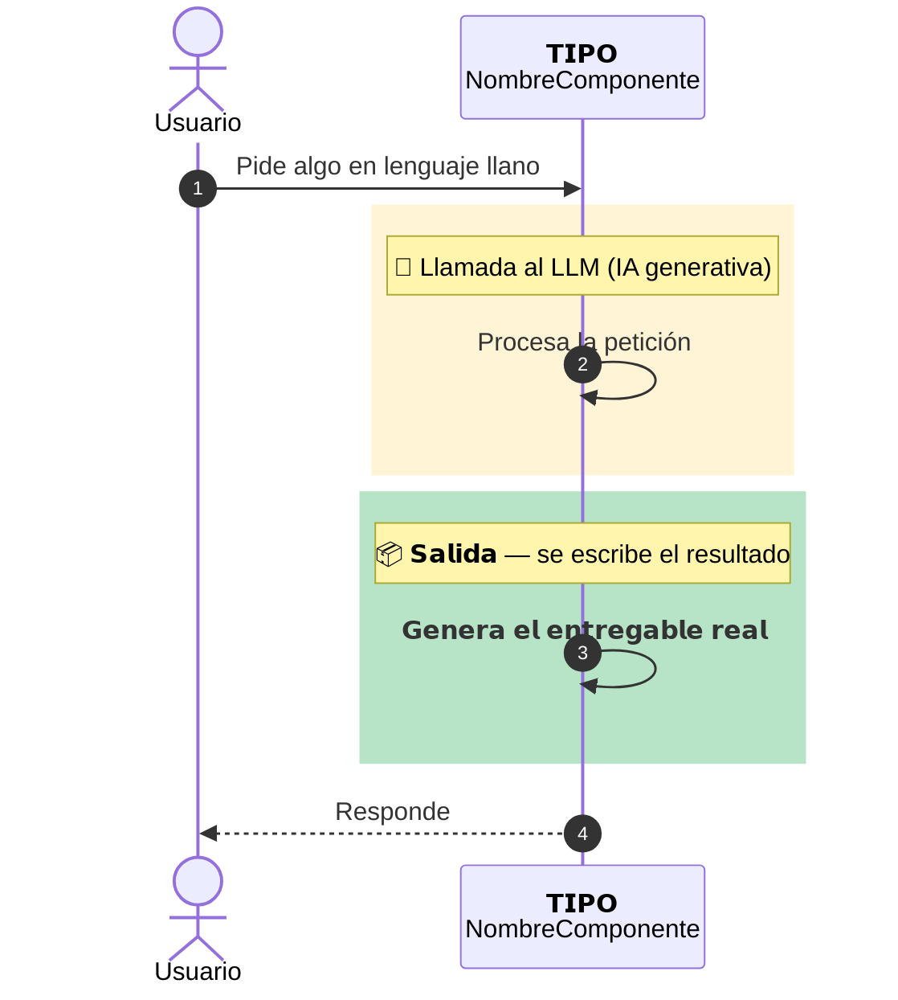
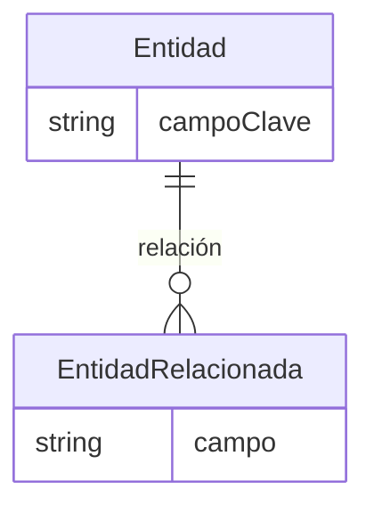

# Plantilla de secciones — familia de documentos de una feature

Toda feature documentada con este arnés produce **hasta 4 documentos** (DOCU,
MANIFEST, LECCIONES, RESUMEN). Los tres que se exportan a Word (todos salvo
`MANIFEST.md`) existen en **dos versiones físicas**: una limpia (para leer
rápido) y una con bloques OOXML (para generar el `.docx`).

```
docs/<CarpetaFeature>/
├── <nombreFeature>DOCU.md          ← versión LIMPIA (sin bloques OOXML)
├── <nombreFeature>LECCIONES.md     ← versión LIMPIA
├── <nombreFeature>RESUMEN.md       ← versión LIMPIA
├── <nombreFeature>MANIFEST.md      ← único, no tiene versión "mdXML"
├── 1_docsFinales/
│   ├── <nombreFeature>DOCU.docx
│   ├── <nombreFeature>LECCIONES.docx
│   └── <nombreFeature>RESUMEN.docx
├── 2_screenshot/
│   └── *.jpg / *.png               ← capturas reales del usuario
├── 3_mdXML/
│   ├── <nombreFeature>DOCU.md      ← versión CON bloques OOXML
│   ├── <nombreFeature>LECCIONES.md
│   └── <nombreFeature>RESUMEN.md
└── 4_diagramas/
    └── *.png                       ← cada diagrama Mermaid exportado suelto
```

`<CarpetaFeature>` y `<nombreFeature>` salen de la convención de nombrado
confirmada en el paso 2 de [SKILL.md](../SKILL.md) — nunca de una convención
asumida por defecto, y nunca aplicada a los componentes documentados en sí
(ver la nota sobre esto en la sección 2 más abajo). Si el proyecto tiene un adaptador propio en
`references/adapters/`, puede fijar un criterio de nombrado concreto (ver
p. ej. [adapters/salesforce.md](adapters/salesforce.md)); si no, usa el
nombre de la feature en PascalCase para la carpeta y camelCase para los
ficheros, sin más transformación.

## 0. Cómo se escriben las dos versiones de cada fichero

Escribe siempre primero la versión **con** bloques OOXML en
`3_mdXML/<nombreFeature><SUFIJO>.md`. Cuando esté terminada, genera la
versión limpia de la raíz quitando exclusivamente los bloques
` ```{=openxml}...``` ` completos — nada más cambia. Las imágenes de
capturas cambian de ruta según la profundidad: `2_screenshot/nombre.jpg` en
la raíz, `../2_screenshot/nombre.jpg` en `3_mdXML/`.

**Nombres de fichero de las capturas.** Antes de referenciar cualquier
imagen de `2_screenshot/`, renómbrala a kebab-case descriptivo con número de
orden secuencial (`3-confirmando-capturas.jpg`, no el nombre que da la
herramienta de captura del sistema). Un nombre con espacios sin codificar
dentro de `` es un riesgo real de romper la conversión a Word con
Pandoc — no una preferencia de estilo. Paso obligatorio, ver
[SKILL.md](../SKILL.md) paso 6.

## 1. `<nombreFeature>DOCU.md` — estructura de secciones

1. **Página 1 (única en esa página): header table** — feature, tipo,
   objeto/entidad principal afectada, estado, última actualización, entorno
   de referencia. Si el adaptador del stack define una fila adicional
   obligatoria (p. ej. un ID de plataforma), añádela aquí. No toques el
   formato de esta página con las reglas de espaciado de más abajo.
2. *(salto de página)* **Índice** — en su propia página.
3. **Resumen ejecutivo** — problema de negocio, solución, valor aportado.
4. **Recorrido visual** *(si hay capturas — ver "Incorporar capturas
   reales" en [SKILL.md](../SKILL.md) paso 6)*.
5. **Arquitectura de la solución** — diagrama de secuencia end-to-end **en
   Mermaid** + tabla de decisiones de diseño clave (decisión / alternativa
   descartada / motivo). Para una feature con más de ~3 rutas de decisión
   internas relevantes, añade también un **diagrama de flujo completo**
   (rutas + estado/variables en cada paso) — ver
   [Nivel de detalle del diagrama de flujo](#nivel-de-detalle-del-diagrama-de-flujo)
   más abajo.
6. **Inventario de componentes** — tabla completa: tipo, nombre/API name,
   ruta exacta, función.
7. **Modelo de datos** — diagrama entidad-relación **en Mermaid** (si aplica)
   + tabla de campos.
8. **Modelo de seguridad / control de acceso** — permisos, requisitos no
   cubiertos automáticamente.
9. **Componentes en detalle** — una subsección por componente real, con
   código fuente relevante citado inline y explicado.
10. **Manejo de errores** — tabla origen del error → mecanismo → mensaje.
11. **Guía de despliegue** — orden correcto con comandos reales.
12. **Configuración post-despliegue** — pasos manuales.
13. **Guía de pruebas** — comando de test automatizado + checklist manual.
14. **Referencias** — enlaces a `MANIFEST.md`/`LECCIONES.md`/`RESUMEN.md`, y
    documentación oficial de cada tecnología real usada.

**Nunca incluyas "Problemas reales encontrados" ni "Limitaciones y alcance
futuro" aquí** — van en `LECCIONES.md`. Cualquier referencia cruzada a un
problema concreto enlaza al fichero externo:
`[Problema 5](<nombreFeature>LECCIONES.md#problema-5)`.

## 2. `<nombreFeature>MANIFEST.md` — estructura

```markdown
# Manifest: <Nombre de la feature>

<1-3 frases de negocio: qué hace y por qué existe>

## Components

| Tipo | API name / identificador | Ruta |
|---|---|---|
| ... | ... | `ruta/exacta/en/el/repo` |
```

Deben aparecer **todos** los componentes confirmados en el paso 4 de
[SKILL.md](../SKILL.md), de todos los tipos — no solo los más obvios. Cada
fila lleva su ruta exacta, nunca solo tipo y nombre. Para un componente que
vive en un fichero suelto, la ruta apunta al fichero; para uno que es una
carpeta, apunta a la carpeta. Si el adaptador del stack exige un identificador
de plataforma adicional (ver p. ej. el ID de agente en el adaptador
Salesforce), añádelo justo debajo de la frase de negocio.

**El nombre de cada componente es siempre el real, nunca "corregido" a la
convención de nombrado** (ver [SKILL.md](../SKILL.md), paso 2) — esa
convención solo nombra los ficheros de esta familia de documentos, no los
componentes que describen. Si un componente se desvía de la convención
vigente del proyecto, añade una cuarta columna `Nota` solo en esa fila
(deja la celda vacía en el resto, no la generalices a toda la tabla):

```markdown
| Tipo | API name / identificador | Ruta | Nota |
|---|---|---|---|
| Apex | LegacyHelper | `force-app/main/default/classes/LegacyHelper.cls` | No sigue la convención `AF_` vigente — componente legado anterior a su adopción |
| Apex | AF_MiFeature_Controller | `force-app/main/default/classes/AF_MiFeature_Controller.cls` | |
```

## 3. `<nombreFeature>LECCIONES.md` — estructura

- Header table corta (Feature, Documento técnico principal, última
  actualización, entorno).
- *(salto de página)* Índice (2 entradas).
- *(salto de página)* **1. Problemas reales encontrados y lecciones
  aprendidas** — síntoma/error literal, causa raíz, solución, lección
  generalizable. **Omite la sección si no hay evidencia real** — nunca
  inventes problemas.
- *(salto de página)* **2. Limitaciones y alcance futuro**.

## 4. `<nombreFeature>RESUMEN.md` — estructura

Ficha corta, pensada para pegar en una tarjeta de equipo — no un resumen
técnico, la versión "cuéntamelo en 30 segundos":

**Título siempre `# Resumen <Nombre de la feature>`**, en ese orden, sin
sufijos añadidos.

- Header table mínima (Feature, Squad/equipo, Estado, Entorno, link al DOCU).
- **Qué hace** — 1-2 frases, lenguaje de negocio.
- **Cómo funciona (en N pasos)** — lista numerada corta, sin código.
- **Diagrama de arquitectura** — si `DOCU.md` tiene un `sequenceDiagram` de
  arquitectura, cópialo aquí tal cual.
- **Componentes creados** — tabla corta tipo → nombre, sin rutas. Termina la
  sección ahí, sin frase de cierre sobre convenciones internas.
- **Dónde ampliar información** — enlaces a DOCU/MANIFEST/LECCIONES.

## Formato de texto: una línea física por párrafo, celdas de tabla cortas

Ninguna celda de tabla lleva una explicación de varias frases — si hace
falta más de ~15 palabras, resume en la celda y desarrolla en un párrafo
normal fuera de la tabla. Nunca partas un párrafo a mano en líneas cortas
dentro del `.md` — cada párrafo, item de lista o cita va en una sola línea
física; el visor ajusta el ancho, no el fichero fuente.

## Espaciado vertical en el `.docx`

**Las líneas en blanco del `.md` no controlan el espaciado del `.docx`** —
Pandoc colapsa cualquier número de líneas en blanco consecutivas al mismo
único salto de párrafo. La única forma fiable de forzar espacio real es un
bloque OOXML crudo:

```
```{=openxml}
<w:p/>
```
```

**Regla de espaciado título↔contenido:**

- **Después de cada título/subtítulo**, 1 párrafo vacío con
  `<w:pPr><w:keepNext/></w:pPr>` (nunca `<w:p/>` a secas) antes del
  contenido — salvo que justo debajo venga otro título/subtítulo.
- **Antes de cada título/subtítulo**, 2 párrafos vacíos `<w:p/>` — salvo que
  ese título ya venga precedido de un salto de página.

## Saltos de página

- **Página 1 → Índice:** salto de página justo después de la header table.
- **Cada sección numerada de primer nivel** (`## N. Título`) empieza en
  página nueva: ` ```{=openxml}<w:p><w:r><w:br w:type="page"/></w:r></w:p>``` `
  justo antes del título.
- **Tablas grandes (≥5-6 filas)** que no caen ya al principio de una página
  recién saltada: su propio salto de página justo antes.

**Nunca uses una línea horizontal (`---` sola) como separador de nada.**

## Todo enlace interno usa un ID explícito de encabezado

Escribir `[texto](#lo-que-yo-crea-que-es-el-slug)` a mano falla casi
siempre. La única forma fiable:

1. En cada encabezado destino, añade un ID explícito:
   `## 3. Arquitectura {#arquitectura}`. Minúsculas, guiones, sin tildes.
2. Enlaza exactamente a ese ID: `[Arquitectura](#arquitectura)`.
3. Después de escribir, comprueba que todo anchor usado tiene su `{#id}`
   correspondiente — o corre el linter de comprensión (paso 7 de
   [SKILL.md](../SKILL.md)), que hace exactamente esta comprobación.

**Nunca uses la notación "§N"** — el texto visible de un enlace es el
título real del encabezado destino, no un número de sección.

## Por qué Mermaid y no ASCII art

`convert_markdown_to_docx` renderiza cada bloque ```mermaid como imagen real
embebida. Un diagrama en ASCII no se puede reconstruir de forma fiable como
gráfico a posteriori — tiene que nacer en Mermaid.

## Nivel de detalle del diagrama de arquitectura (`sequenceDiagram`)

Objetivo: que se lea **de un vistazo**, no que documente cada línea.

- `autonumber`, nunca números a mano.
- Participantes en dos líneas (`<br/>`): tipo en mayúsculas y negrita real
  arriba, nombre/identificador real abajo. Mermaid no soporta negrita real
  en estas etiquetas — usa caracteres Unicode "Mathematical Sans-Bold"
  (`𝗔𝗣𝗘𝗫`, `𝗟𝗪𝗖`...; el adaptador de cada stack trae su propia tabla de
  conversión, cópiala literal, no la regeneres a mano).
- Mensajes en **lenguaje llano de negocio**, nunca firmas de método exactas.
- Varios pasos internos de un mismo componente se colapsan en **un único
  mensaje reflexivo**.
- **Toda llamada a un LLM/IA generativa se resalta siempre** en un bloque
  `rect` de color con una `Note` (🤖 + "Llamada al LLM (IA generativa)").
- **Todo paso que produce una salida o entregable real (ficheros escritos,
  exportación a Word, diagramas exportados...) se resalta siempre** en un
  bloque `rect rgb(183, 228, 199)` (verde) con una `Note` (📦 + "Salida" en
  negrita) — el mismo mecanismo que resalta las llamadas a LLM, pero para
  marcar dónde aparece el resultado tangible del proceso, no solo dónde
  razona el modelo. Mermaid no soporta negrita real en `Note`/mensajes de un
  `sequenceDiagram` (ni siquiera con `<b>`, que se imprime literal) — usa el
  mismo truco Unicode "Mathematical Sans-Bold" que los nombres de
  participante (`𝗦𝗮𝗹𝗶𝗱𝗮`, `𝗘𝘀𝗰𝗿𝗶𝗯𝗲 𝗗𝗢𝗖𝗨...`).
- **8-12 mensajes como objetivo.** Si hace falta más, divide en dos
  diagramas (uno por sub-flujo).



## Nivel de detalle del diagrama de flujo

Para el diagrama de flujo completo (rutas + variables) que complementa al
`sequenceDiagram` cuando la feature tiene lógica determinista con varias
ramas: usa `flowchart TD`, un `classDef` por tipo de paso (p. ej. pasos con
LLM vs pasos de código puro), y agrupa por componente/módulo con
`subgraph` cuando haya más de uno. Etiqueta cada arista con la condición
exacta, y cada nodo con la variable/estado que fija — el objetivo es que un
humano pueda seguir "qué ruta se sigue en cada caso" sin leer el código.
Dale color de fondo propio a cada `subgraph` (`style X fill:#...`) distinto
del color de los `classDef` de nodo, para que agrupación y tipo de paso no
se confundan visualmente.

## Ejemplo mínimo de `erDiagram`


