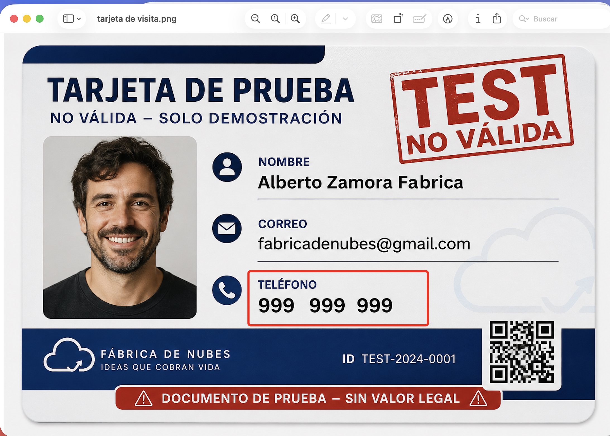
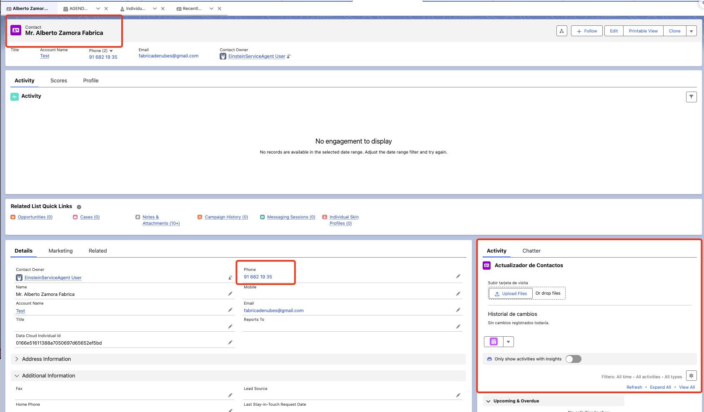
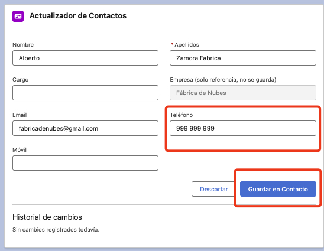
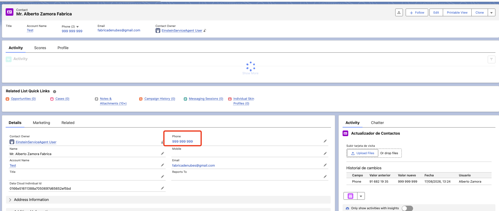
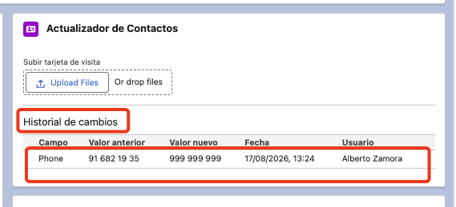
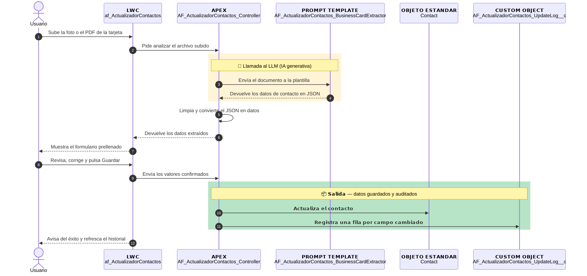
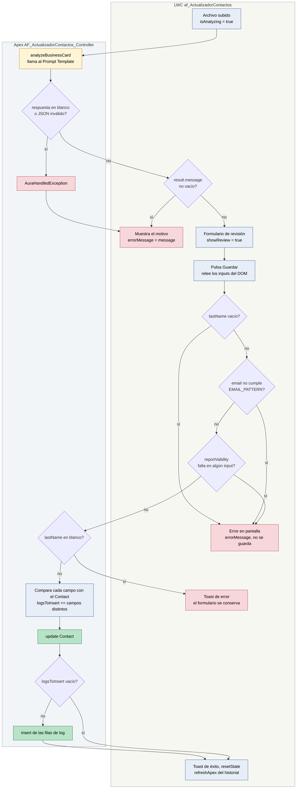
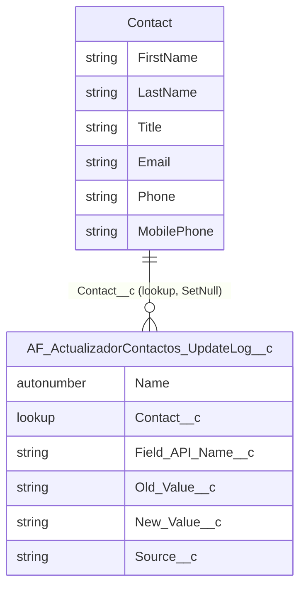
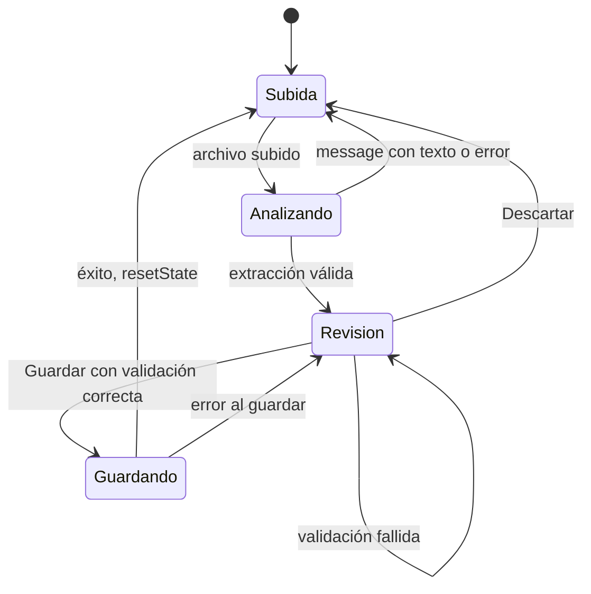

# Actualizador de Contactos — Documentación Técnica

| | |
|---|---|
| **Feature** | Actualizador de Contactos |
| **Tipo** | Einstein Generative AI (Prompt Template Flex) + Apex + LWC |
| **Objeto Salesforce afectado** | `Contact` |
| **Estado** | Desplegado en el org de referencia (capturas reales del 17/08/2026) |
| **Lector objetivo** | Developer (nivel técnico) |
| **Última actualización** | 2026-10-04 |
| **Org de referencia** | Agentforce_Sandbox |

## Índice

1. [Resumen ejecutivo](#resumen-ejecutivo)
2. [Recorrido visual](#recorrido-visual)
3. [Arquitectura de la solución](#arquitectura)
4. [Inventario de componentes](#inventario-componentes)
5. [Modelo de datos](#modelo-datos)
6. [Modelo de seguridad](#modelo-seguridad)
7. [Componentes en detalle](#componentes-detalle)
   - [Prompt Template](#componente-prompt-template)
   - [Apex — controlador](#componente-apex)
   - [Apex — clase de test](#componente-apex-test)
   - [LWC](#componente-lwc)
8. [Manejo de errores](#manejo-errores)
9. [Guía de despliegue](#guia-despliegue)
10. [Configuración post-despliegue](#configuracion-post-despliegue)
11. [Guía de pruebas](#guia-pruebas)
12. [Referencias](#referencias)

## 1. Resumen ejecutivo {#resumen-ejecutivo}

**Problema de negocio.** Mantener al día los datos de un `Contact` a partir de una tarjeta de visita o un carnet es trabajo manual: alguien lee el documento y teclea nombre, cargo, email y teléfonos campo a campo, con el riesgo de errores de transcripción y sin rastro de qué se cambió.

**Solución.** Un componente en la página de detalle del `Contact` permite subir una foto o un PDF del documento. Un Prompt Template de Einstein lee el archivo y devuelve los datos de contacto en JSON; el componente los muestra en un formulario editable y solo los guarda cuando el usuario los revisa y pulsa "Guardar en Contacto". Cada campo que cambia genera una fila de auditoría (campo, valor anterior, valor nuevo, quién y cuándo) en un objeto de log propio, visible en el mismo componente.

**Valor aportado.** Se elimina el tecleo manual sin ceder el control: la IA propone, la persona confirma, y todo cambio queda trazado.

La feature no incluye ningún Bot/Agente Agentforce ni Data Library: la IA se usa mediante una llamada directa a un Prompt Template desde Apex.

## 2. Recorrido visual {#recorrido-visual}

Las cinco capturas siguientes son del org de referencia y siguen el orden real del flujo, con el mismo caso de principio a fin: se cambia el teléfono de un contacto a partir de una tarjeta de prueba.

### 2.1 El documento que se sube {#recorrido-1}



Se ve la tarjeta de prueba que se va a subir: nombre "Alberto Zamora Fabrica", correo `fabricadenubes@gmail.com`, teléfono `999 999 999` (recuadrado en rojo) y, en el pie, la empresa "Fábrica de Nubes". Es el punto de partida del flujo, antes de tocar Salesforce: este es el archivo que el usuario entregará al componente y el teléfono recuadrado es el dato que debe acabar en el `Contact`.

### 2.2 La ficha del Contact antes de actualizar {#recorrido-2}



Se ve la página de detalle del contacto "Mr. Alberto Zamora Fabrica" con el teléfono antiguo `91 682 19 35` y, a la derecha, el componente "Actualizador de Contactos" con el botón "Upload Files" y el historial vacío ("Sin cambios registrados todavía"). Es el estado inicial del componente (`showUpload` verdadero): todavía no se ha subido nada y no existe ninguna fila de log para este contacto.

### 2.3 El formulario de revisión prellenado por la IA {#recorrido-3}



Se ve el formulario de revisión con los datos que ha devuelto el Prompt Template: Nombre "Alberto", Apellidos "Zamora Fabrica", Email y Teléfono `999 999 999`; "Empresa" aparece deshabilitado con "Fábrica de Nubes" y los campos Cargo y Móvil quedan vacíos porque la tarjeta no los trae. Es el punto de control humano del flujo (`showReview` verdadero): el análisis ya ha terminado, pero nada se ha escrito en el `Contact` hasta que se pulse "Guardar en Contacto".

### 2.4 La ficha del Contact ya actualizada {#recorrido-4}



Se ve la misma ficha tras guardar: el campo Phone muestra ahora `999 999 999` (recuadrado) y el componente ha vuelto a su estado de subida, con una fila nueva en "Historial de cambios". Es el resultado de `saveExtractedFields`: el `Contact` se ha actualizado y el componente se ha reiniciado para admitir otro documento.

### 2.5 El historial con el cambio registrado {#recorrido-5}



Se ve en detalle la tabla "Historial de cambios" con una única fila: campo `Phone`, valor anterior `91 682 19 35`, valor nuevo `999 999 999`, fecha 17/08/2026 13:24 y usuario "Alberto Zamora". Es el final del flujo y la prueba de la auditoría: solo se ha registrado el campo que cambió de verdad, no los que la IA devolvió con el mismo valor que ya tenía el contacto.

## 3. Arquitectura de la solución {#arquitectura}

### 3.1 Diagrama de arquitectura {#arquitectura-diagrama}



### 3.2 Diagrama de flujo: rutas y estado {#arquitectura-flujo}

El diagrama de secuencia muestra el camino feliz. Este otro recoge todas las rutas de decisión y la variable de estado que fija cada paso, que es lo que hace falta para depurar un caso concreto.



Colores: amarillo, paso con LLM; azul, código determinista; verde, escritura real en base de datos; rojo, salida de error.

### 3.3 Decisiones de diseño clave {#arquitectura-decisiones}

| Decisión | Alternativa descartada | Motivo |
|---|---|---|
| Revisión humana obligatoria antes de guardar | Autoguardado tras el análisis | La IA propone; la persona confirma |
| `saveExtractedFields` recibe `String` sueltos | Recibir el DTO `ContactExtraction` | Como parámetro de entrada llegaba vacío |
| Releer los inputs del DOM al guardar | Confiar solo en el estado reactivo | El autocompletado puede desincronizarlos |
| `temperature = 0` en la llamada | Temperatura por defecto | Extracción literal, sin creatividad |
| Log solo de campos que cambian | Una fila por campo en cada guardado | Auditoría sin ruido |
| `companyName` solo se muestra | Crear o enlazar el `Account` | Fuera de alcance en esta versión |

Las dos decisiones sobre el guardado nacen de fallos reales: ver [Problema 5](actualizadorDeContactosLECCIONES.md#problema-5) (el DTO como parámetro de entrada) y [Problema 6](actualizadorDeContactosLECCIONES.md#problema-6) (el estado desincronizado del DOM).

## 4. Inventario de componentes {#inventario-componentes}

| # | Tipo | API name | Ruta | Función |
|---|---|---|---|---|
| 1 | Prompt Template | `AF_ActualizadorContactos_BusinessCardExtractor` | `force-app/main/default/genAiPromptTemplates/AF_ActualizadorContactos_BusinessCardExtractor.genAiPromptTemplate-meta.xml` | Lee el documento y devuelve JSON |
| 2 | Custom Object | `AF_ActualizadorContactos_UpdateLog__c` | `force-app/main/default/objects/AF_ActualizadorContactos_UpdateLog__c/` | Log de auditoría, 5 campos custom |
| 3 | Permission Set | `AF_ActualizadorContactos_Access` | `force-app/main/default/permissionsets/AF_ActualizadorContactos_Access.permissionset-meta.xml` | CRUD y FLS sobre el objeto de log |
| 4 | Apex | `AF_ActualizadorContactos_Controller` | `force-app/main/default/classes/AF_ActualizadorContactos_Controller.cls` | Llama a la IA, guarda y audita |
| 5 | Apex (test) | `AF_ActualizadorContactos_ControllerTest` | `force-app/main/default/classes/AF_ActualizadorContactos_ControllerTest.cls` | 9 métodos de test |
| 6 | LWC | `af_ActualizadorContactos` | `force-app/main/default/lwc/af_ActualizadorContactos/` | Subida, revisión, guardado e historial |

Las rutas son relativas a la raíz del proyecto Salesforce DX (`AGENTFORCE_SANDBOX`). El inventario coincide con [actualizadorDeContactosMANIFEST.md](actualizadorDeContactosMANIFEST.md).

## 5. Modelo de datos {#modelo-datos}

### 5.1 Diagrama entidad-relación {#modelo-datos-erd}



### 5.2 Objeto `AF_ActualizadorContactos_UpdateLog__c` {#modelo-datos-objeto}

Label "AF_Contact Field Update Log", `sharingModel` `ReadWrite`, nombre autonumérico con formato `LOG-{0000}`.

| Campo | Tipo | Obligatorio | Contenido |
|---|---|---|---|
| `Contact__c` | Lookup a `Contact` | No | Contacto modificado; `SetNull` al borrarlo |
| `Field_API_Name__c` | Text(40) | Sí | API name del campo cambiado, p. ej. `Phone` |
| `Old_Value__c` | Text(255) | No | Valor anterior; `null` si estaba vacío |
| `New_Value__c` | Text(255) | No | Valor nuevo; `null` si se vació |
| `Source__c` | Text(80) | No | Origen; por defecto `"Actualizador de Contactos"` |

Quién y cuándo no son campos propios: salen de los campos de sistema `CreatedBy` y `CreatedDate` de cada fila. Como el lookup usa `SetNull`, borrar un `Contact` no borra sus filas de log, pero las deja sin contacto asociado.

Del `Contact` solo se escriben seis campos estándar: `FirstName`, `LastName`, `Title`, `Email`, `Phone` y `MobilePhone`. La feature no añade campos custom a `Contact`.

## 6. Modelo de seguridad {#modelo-seguridad}

### 6.1 Permission Set `AF_ActualizadorContactos_Access` {#seguridad-permission-set}

| Permiso | Valor |
|---|---|
| Objeto `AF_ActualizadorContactos_UpdateLog__c` | Read, Create, Edit, View All; sin Delete ni Modify All |
| `Contact__c`, `Old_Value__c`, `New_Value__c`, `Source__c` | Lectura y edición |
| `Field_API_Name__c` | No aparece en el XML |

`Field_API_Name__c` no lleva `fieldPermissions` porque es un campo obligatorio: Salesforce no admite FLS explícita sobre campos requeridos, que son siempre accesibles para quien tiene acceso al objeto.

Desplegar el objeto no concede acceso a nadie por sí solo. Sin este Permission Set asignado, los DML y las consultas sobre el log fallan — ver [Problema 4](actualizadorDeContactosLECCIONES.md#problema-4).

### 6.2 Requisitos que el Permission Set no cubre {#seguridad-requisitos-adicionales}

El Permission Set solo da acceso al objeto de log. El usuario necesita además, por otra vía (perfil u otro Permission Set):

- Acceso a la clase Apex `AF_ActualizadorContactos_Controller`: el XML no incluye `classAccesses`.
- Lectura y edición sobre `Contact` y sus seis campos.
- Permiso para ejecutar Prompt Templates, con Einstein Generative AI activo en el org.
- Permiso para subir archivos al registro, porque `lightning-file-upload` adjunta el archivo al `Contact`.

La clase es `with sharing`, así que las consultas respetan el acceso a registros del usuario. No aplica comprobación explícita de CRUD/FLS (no usa `WITH USER_MODE` ni `Security.stripInaccessible`): el SOQL y los DML se ejecutan en modo sistema respecto a permisos de campo.

## 7. Componentes en detalle {#componentes-detalle}

### 7.1 Prompt Template — `AF_ActualizadorContactos_BusinessCardExtractor` {#componente-prompt-template}

| Propiedad | Valor |
|---|---|
| Tipo | `einstein_gpt__flex` |
| Modelo | `sfdc_ai__DefaultOpenAIGPT4OmniMini` |
| Input | `File` (`SOBJECT://ContentDocument`), obligatorio, referencia `Input:File` |
| Estado / visibilidad | `Published` / `Global` |
| Citas | Desactivadas |

El prompt pide exclusivamente un JSON con una estructura fija, que es el contrato con Apex:

```
{
  "message": "",
  "firstName": null,
  "lastName": null,
  "title": null,
  "companyName": null,
  "email": null,
  "phone": null,
  "mobilePhone": null
}
```

Las siete reglas del prompt fijan el comportamiento que el resto del código da por hecho:

- **Qué documentos acepta.** Tarjetas de visita, carnets, credenciales o badges que muestren el nombre de una persona junto a datos de contacto. Si no hay nombre o el documento no se puede leer, todos los datos van en `null` y el motivo se explica en `message`.
- **No inventar.** Un dato que no aparece literalmente en el documento es `null`.
- **Teléfonos.** `mobilePhone` solo se rellena si el documento distingue explícitamente el móvil ("Mob", "Cel", "M:"); un único número sin tipo va en `phone`.
- **Formato.** Sin espacios sobrantes, sin comillas tipográficas, sin texto fuera del JSON y sin bloques de código Markdown; `message` siempre en español.

El campo `message` es el canal de error de negocio: vacío significa "extracción válida", y con texto significa "documento rechazado". El LWC decide qué pantalla mostrar mirando solo ese campo.

`activeVersionIdentifier` y `versionIdentifier` los genera la plataforma, no se escriben a mano — ver [Problema 1](actualizadorDeContactosLECCIONES.md#problema-1).

### 7.2 Apex — `AF_ActualizadorContactos_Controller` {#componente-apex}

Clase `public with sharing` con tres métodos `@AuraEnabled` y dos auxiliares `@TestVisible`.

| Método | Visibilidad | Qué hace |
|---|---|---|
| `analyzeBusinessCard(Id)` | `@AuraEnabled` | Llama al Prompt Template con el archivo |
| `parseExtraction(String)` | `private`, `@TestVisible` | Limpia y deserializa el JSON |
| `saveExtractedFields(Id, String x6)` | `@AuraEnabled` | Actualiza el `Contact` y escribe el log |
| `addLogIfChanged(...)` | `private`, `@TestVisible` | Añade una fila si el valor cambió |
| `getUpdateHistory(Id)` | `@AuraEnabled(cacheable=true)` | Devuelve las últimas 50 filas de log |

#### DTO `ContactExtraction` {#apex-dto}

Clase interna con ocho `String` `@AuraEnabled` (`message`, `firstName`, `lastName`, `title`, `companyName`, `email`, `phone`, `mobilePhone`). Sus nombres coinciden uno a uno con las claves del JSON del prompt: es lo que permite deserializar sin mapeo manual. Se usa solo como tipo de retorno hacia el LWC.

#### `analyzeBusinessCard` {#apex-analyze}

```apex
additionalConfig.applicationName = 'PromptTemplateGenerationsInvocable';
additionalConfig.temperature = 0;

Map<String, String> fileRecordId = new Map<String, String>{ 'id' => contentDocumentId };
ConnectApi.WrappedValue fileValue = new ConnectApi.WrappedValue();
fileValue.value = fileRecordId;

generationsInput.isPreview = false;
generationsInput.inputParams = new Map<String, ConnectApi.WrappedValue>{
    'Input:File' => fileValue
};

ConnectApi.EinsteinPromptTemplateGenerationsRepresentation generationsOutput =
    ConnectApi.EinsteinLLM.generateMessagesForPromptTemplate(PROMPT_TEMPLATE_NAME, generationsInput);
```

Tres detalles que no son obvios:

- El archivo no se pasa como `Id` suelto sino como un mapa con la clave `'id'`. Asignar el `Id` directamente produce un error en ejecución — ver [Problema 3](actualizadorDeContactosLECCIONES.md#problema-3).
- La clave `'Input:File'` debe coincidir con el `referenceName` del input del Prompt Template.
- `temperature = 0` busca la respuesta más determinista posible, coherente con la regla del prompt de no inventar datos.

De la respuesta solo se usa el texto de la primera generación (`generations[0]?.text`), con navegación segura; si no hay generaciones, se pasa `null` a `parseExtraction`. Todo el método está envuelto en un `try/catch` que relanza cualquier fallo como `AuraHandledException` con el prefijo "No se pudo analizar el documento: ".

#### `parseExtraction` {#apex-parse}

```apex
String cleanJson = rawResponse.trim().removeStart('```json').removeEnd('```').trim();
return (ContactExtraction) JSON.deserialize(cleanJson, ContactExtraction.class);
```

Aunque el prompt prohíbe los bloques de código Markdown, el método los retira por si el modelo los añade igualmente. Lanza `AuraHandledException` en dos casos: respuesta en blanco y JSON no deserializable.

#### `saveExtractedFields` {#apex-save}

```apex
public static void saveExtractedFields(Id contactId, String firstName, String lastName,
        String title, String email, String phone, String mobilePhone)
```

Orden de ejecución:

1. Valida que `lastName` no esté en blanco (segunda barrera; la primera está en el LWC).
2. Lee del `Contact` los seis campos actuales.
3. Llama a `addLogIfChanged` una vez por campo, comparando el valor actual con el recibido.
4. Asigna los seis valores y hace `update` del `Contact`.
5. Inserta las filas de log solo si la lista no está vacía.

Los seis campos se sobrescriben siempre con lo que llega del formulario: un campo que el usuario deja vacío borra el valor que tuviera el `Contact`, y ese vaciado también queda en el log. `companyName` no es parámetro del método, por eso nunca se guarda.

El `update` y el `insert` van en la misma transacción: si el `insert` del log falla, la excepción se relanza como `AuraHandledException` y la transacción entera se revierte, de modo que no puede quedar un `Contact` actualizado sin su auditoría.

La firma usa parámetros primitivos en lugar del DTO a propósito — ver [Problema 5](actualizadorDeContactosLECCIONES.md#problema-5).

#### `addLogIfChanged` {#apex-addlog}

```apex
String normalizedOld = String.isBlank(oldValue) ? null : oldValue;
String normalizedNew = String.isBlank(newValue) ? null : newValue;
if (normalizedOld == normalizedNew) {
    return;
}
```

Normaliza vacío y `null` al mismo valor antes de comparar: pasar de `null` a cadena vacía no cuenta como cambio. La comparación con `==` entre `String` en Apex no distingue mayúsculas de minúsculas, así que un cambio que solo altere la capitalización (p. ej. `ana@acme.com` a `Ana@acme.com`) se guarda en el `Contact` pero no genera fila de log.

#### `getUpdateHistory` {#apex-history}

Consulta `Field_API_Name__c`, `Old_Value__c`, `New_Value__c`, `CreatedDate` y `CreatedBy.Name` del contacto, ordenado por fecha descendente y limitado a 50 filas. Es `cacheable=true` para poder usarse con `@wire`; por eso el LWC tiene que refrescarlo explícitamente tras guardar.

### 7.3 Apex — `AF_ActualizadorContactos_ControllerTest` {#componente-apex-test}

| Método de test | Qué verifica |
|---|---|
| `testParseExtraction_cleanJson` | JSON limpio se mapea al DTO |
| `testParseExtraction_withMarkdownFences` | Se retiran los delimitadores de bloque Markdown |
| `testParseExtraction_blankResponse_throws` | Respuesta en blanco lanza excepción |
| `testParseExtraction_invalidJson_throws` | Texto que no es JSON lanza excepción |
| `testAnalyzeBusinessCard_invalidDocument_throwsHandledException` | Cualquier fallo sale como `AuraHandledException` |
| `testSaveExtractedFields_logsOnlyChangedFields` | Cambian 2 campos de 6: 2 filas de log |
| `testSaveExtractedFields_noChanges_noLogs` | Sin cambios: 0 filas |
| `testSaveExtractedFields_blankLastName_throws` | Apellido en blanco lanza excepción |
| `testGetUpdateHistory_returnsExistingLogs` | Devuelve el log existente del contacto |

La llamada real a `ConnectApi.EinsteinLLM` no se ejercita con una respuesta válida: el único test de `analyzeBusinessCard` le pasa `null` y comprueba que el fallo se envuelve correctamente. El camino feliz de la extracción solo se valida con la [prueba manual](#pruebas-manual). La lógica de parseo sí está cubierta porque `parseExtraction` es `@TestVisible` y se prueba aparte.

### 7.4 LWC — `af_ActualizadorContactos` {#componente-lwc}

Expuesto solo en `lightning__RecordPage` y restringido al objeto `Contact` (`masterLabel` "AF_Actualizador de Contactos", API 67.0). Recibe el `recordId` de la página.

#### Estados del componente {#lwc-estados}



| Estado | Condición en el código | Qué se pinta |
|---|---|---|
| Subida | `!isAnalyzing && !showReview` | `lightning-file-upload` |
| Analizando | `isAnalyzing` | Spinner |
| Revisión | `showReview` | Formulario y botones |
| Guardando | `showReview && isSaving` | Formulario con "Guardar" deshabilitado |

El bloque de error (`errorMessage`) y el historial son independientes del estado: el historial se pinta siempre al pie.

#### Subida y análisis {#lwc-analisis}

`lightning-file-upload` acepta `.pdf`, `.png`, `.jpg` y `.jpeg` y recibe `record-id={recordId}`, así que el archivo queda adjunto al `Contact` como `ContentDocument` y permanece ahí después del análisis. `handleUploadFinished` toma el `documentId` del primer archivo y llama a `analyzeBusinessCard`:

```javascript
.then((result) => {
    if (result.message) {
        this.errorMessage = result.message;
        return;
    }
    this.firstName = (result.firstName || '').trim();
    // ... resto de campos
    this.showReview = true;
})
```

Si `message` trae texto, se muestra como error y no se abre el formulario. Si no, cada campo se normaliza (`null` pasa a cadena vacía, con `trim`) y se activa la revisión.

#### Revisión y guardado {#lwc-guardado}

Cada `lightning-input` editable lleva `data-field` con el nombre de la propiedad, y un único `handleFieldChange` actualiza `this[field]`. "Empresa" no tiene `data-field` y está `disabled`: se muestra solo como referencia.

`handleSave` empieza releyendo el formulario:

```javascript
const inputs = this.template.querySelectorAll('lightning-input[data-field]');
inputs.forEach((input) => {
    this[input.dataset.field] = input.value;
});
```

Sus pasos, en orden:

1. Relee el valor de cada input directamente del DOM, por si el navegador autocompletó un campo sin disparar el evento `input` — ver [Problema 6](actualizadorDeContactosLECCIONES.md#problema-6).
2. Comprueba que `lastName` no esté vacío.
3. Comprueba el email contra `EMAIL_PATTERN` (`/^\S+@\S+\.\S+$/`), que rechaza cualquier espacio.
4. Ejecuta `reportValidity()` en cada input.
5. Llama a `saveExtractedFields` con los seis valores como parámetros sueltos.

Tras un guardado correcto lanza un toast de éxito, ejecuta `resetState()` y devuelve `refreshApex(this.wiredHistoryResult)` para que el historial muestre las filas nuevas. Si falla, lanza un toast de error y conserva el formulario para poder corregir y reintentar.

#### Historial {#lwc-historial}

`@wire(getUpdateHistory, { contactId: '$recordId' })` guarda el resultado completo en `wiredHistoryResult` (necesario para `refreshApex`) y los datos en `history`. La tabla muestra campo, valor anterior, valor nuevo, fecha y usuario; si no hay filas, el texto "Sin cambios registrados todavía". El `@wire` no trata `result.error`: si la consulta falla, el historial se queda vacío sin mensaje.

## 8. Manejo de errores {#manejo-errores}

| Origen | Mecanismo | Mensaje al usuario |
|---|---|---|
| Documento sin nombre o ilegible | `message` del JSON | El motivo redactado por la IA, en español |
| Fallo en la llamada a la IA | `AuraHandledException` | "No se pudo analizar el documento: ..." |
| Respuesta de la IA en blanco | `AuraHandledException` | "La IA no devolvió ningún resultado para este documento." |
| JSON no válido | `AuraHandledException` | "La respuesta de la IA no tiene un formato válido." |
| Apellido vacío (LWC) | Validación en `handleSave` | "El apellido es obligatorio. Complétalo antes de guardar." |
| Email mal formado (LWC) | `EMAIL_PATTERN` | "El email ... no es válido (revisa espacios o el formato)..." |
| Apellido vacío (Apex) | `AuraHandledException` | "El apellido es obligatorio; revisa el dato antes de guardar." |
| Fallo de DML o consulta al guardar | `AuraHandledException` | Toast "Error al guardar" con "No se pudo guardar el contacto: ..." |
| Error sin `body.message` | `extractErrorMessage` | "Ha ocurrido un error inesperado." |

Los errores de análisis y de validación se pintan en línea, en rojo, dentro del componente; los de guardado salen como toast. En ambos casos el texto procede de `error.body.message`, que es donde llega el mensaje de una `AuraHandledException`.

`parseExtraction` se ejecuta dentro del `try` de `analyzeBusinessCard`, así que sus dos excepciones se capturan y se relanzan desde el `catch` exterior con el prefijo "No se pudo analizar el documento: ". En `saveExtractedFields` la validación del apellido está antes del `try`, y su excepción sale tal cual.

## 9. Guía de despliegue {#guia-despliegue}

El orden importa por dos motivos: Apex referencia el objeto de log en tiempo de compilación, y un fallo en cualquier componente revierte el despliegue entero — ver [Problema 2](actualizadorDeContactosLECCIONES.md#problema-2). Por eso el Prompt Template va solo y primero.

```bash
# 1. Prompt Template, aislado
sf project deploy start \
  --metadata GenAiPromptTemplate:AF_ActualizadorContactos_BusinessCardExtractor \
  --target-org Agentforce_Sandbox

# 2. Modelo de datos y acceso
sf project deploy start \
  --metadata CustomObject:AF_ActualizadorContactos_UpdateLog__c \
  --metadata PermissionSet:AF_ActualizadorContactos_Access \
  --target-org Agentforce_Sandbox

# 3. Asignar el Permission Set antes de correr tests
sf org assign permset --name AF_ActualizadorContactos_Access --target-org Agentforce_Sandbox

# 4. Lógica e interfaz
sf project deploy start \
  --metadata ApexClass:AF_ActualizadorContactos_Controller \
  --metadata ApexClass:AF_ActualizadorContactos_ControllerTest \
  --metadata LightningComponentBundle:af_ActualizadorContactos \
  --target-org Agentforce_Sandbox
```

Si el Prompt Template se crea desde cero en otro org, el XML no debe llevar un `versionIdentifier` escrito a mano; tras desplegar, recupéralo para sincronizar el identificador real:

```bash
sf project retrieve start \
  --metadata GenAiPromptTemplate:AF_ActualizadorContactos_BusinessCardExtractor \
  --target-org Agentforce_Sandbox
```

## 10. Configuración post-despliegue {#configuracion-post-despliegue}

1. Asignar `AF_ActualizadorContactos_Access` a cada usuario que vaya a usar el componente.
2. Dar a esos usuarios lo que el Permission Set no cubre: ver [Requisitos que el Permission Set no cubre](#seguridad-requisitos-adicionales).
3. En Lightning App Builder, editar la página de registro de `Contact`, arrastrar el componente "AF_Actualizador de Contactos" y activar la página.
4. Comprobar que el Prompt Template está en estado `Published` en Prompt Builder.

## 11. Guía de pruebas {#guia-pruebas}

### 11.1 Tests automatizados {#pruebas-automatizadas}

```bash
sf apex run test \
  --class-names AF_ActualizadorContactos_ControllerTest \
  --result-format human --code-coverage --wait 10 \
  --target-org Agentforce_Sandbox
```

Deben pasar los 9 métodos. Las líneas del camino feliz de `analyzeBusinessCard` quedan sin cubrir por diseño (ver [Apex — clase de test](#componente-apex-test)).

### 11.2 Prueba manual end-to-end {#pruebas-manual}

Reproduce el [Recorrido visual](#recorrido-visual):

1. Abrir un `Contact` y anotar su teléfono actual.
2. Subir una tarjeta con un teléfono distinto: aparece el spinner y después el formulario prellenado.
3. Comprobar que "Empresa" está deshabilitado y que los datos ausentes en la tarjeta quedan vacíos.
4. Vaciar "Apellidos" y guardar: debe aparecer el error de apellido obligatorio, sin guardar nada.
5. Escribir un email con un espacio y guardar: debe aparecer el error de email no válido.
6. Corregir y guardar: toast de éxito, el formulario se cierra y el historial muestra una fila por cada campo cambiado.
7. Subir la misma tarjeta otra vez y guardar sin tocar nada: no debe aparecer ninguna fila nueva.
8. Subir una imagen sin ningún nombre de persona: debe mostrarse el motivo en rojo y no abrirse el formulario.

## 12. Referencias {#referencias}

- [actualizadorDeContactosMANIFEST.md](actualizadorDeContactosMANIFEST.md) — inventario de componentes.
- [actualizadorDeContactosLECCIONES.md](actualizadorDeContactosLECCIONES.md) — problemas reales, limitaciones y alcance futuro.
- [actualizadorDeContactosRESUMEN.md](actualizadorDeContactosRESUMEN.md) — ficha corta para el equipo.
- [Apex Reference: ConnectApi.EinsteinLLM](https://developer.salesforce.com/docs/atlas.en-us.apexref.meta/apexref/apex_ConnectAPI_EinsteinLLM_static_methods.htm)
- [Prompt Builder](https://help.salesforce.com/s/articleView?id=sf.prompt_builder_about.htm&type=5)
- [Lightning Web Components Developer Guide](https://developer.salesforce.com/docs/platform/lwc/guide)
- [lightning-file-upload](https://developer.salesforce.com/docs/component-library/bundle/lightning-file-upload)
