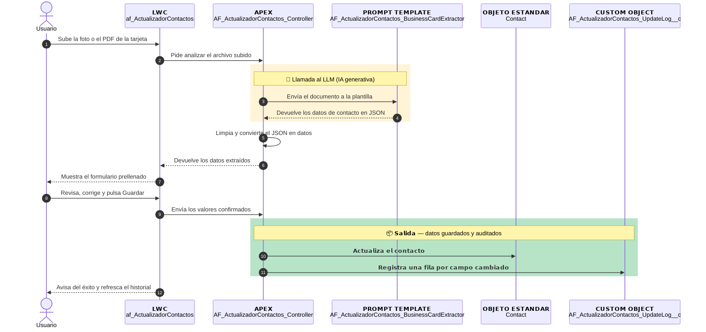

# Resumen Actualizador de Contactos

| | |
|---|---|
| **Feature** | Actualizador de Contactos |
| **Squad** | Agentforce (`AF_`) |
| **Estado** | Desplegado en el org de referencia |
| **Org de referencia** | Agentforce_Sandbox |
| **Documento técnico** | [actualizadorDeContactosDOCU.md](actualizadorDeContactosDOCU.md) |

```{=openxml}
<w:p/>
<w:p/>
```

## Qué hace

```{=openxml}
<w:p><w:pPr><w:keepNext/></w:pPr></w:p>
```

Desde la ficha de un contacto se sube la foto o el PDF de una tarjeta de visita o un carnet, y la IA rellena por ti nombre, apellidos, cargo, email y teléfonos. Tú revisas, corriges si hace falta y confirmas; cada cambio queda registrado con su valor anterior, quién lo hizo y cuándo.

```{=openxml}
<w:p/>
<w:p/>
```

## Cómo funciona (en 5 pasos)

```{=openxml}
<w:p><w:pPr><w:keepNext/></w:pPr></w:p>
```

1. Abres un contacto y subes el documento en el componente "Actualizador de Contactos".
2. La IA lee el documento y extrae los datos de contacto.
3. Aparece un formulario ya rellenado, que puedes editar.
4. Pulsas "Guardar en Contacto" y el contacto se actualiza.
5. El historial del componente muestra una fila por cada dato que ha cambiado.

```{=openxml}
<w:p/>
<w:p/>
```

## Diagrama de arquitectura

```{=openxml}
<w:p><w:pPr><w:keepNext/></w:pPr></w:p>
```



```{=openxml}
<w:p/>
<w:p/>
```

## Componentes creados

```{=openxml}
<w:p><w:pPr><w:keepNext/></w:pPr></w:p>
```

| Tipo | Nombre |
|---|---|
| Prompt Template | `AF_ActualizadorContactos_BusinessCardExtractor` |
| Custom Object | `AF_ActualizadorContactos_UpdateLog__c` |
| Permission Set | `AF_ActualizadorContactos_Access` |
| Apex | `AF_ActualizadorContactos_Controller` |
| Apex (test) | `AF_ActualizadorContactos_ControllerTest` |
| LWC | `af_ActualizadorContactos` |

```{=openxml}
<w:p/>
<w:p/>
```

## Dónde ampliar información

```{=openxml}
<w:p><w:pPr><w:keepNext/></w:pPr></w:p>
```

- [Documento técnico completo](actualizadorDeContactosDOCU.md)
- [Inventario de componentes](../actualizadorDeContactosMANIFEST.md)
- [Problemas reales y limitaciones](actualizadorDeContactosLECCIONES.md)
