# Arnés de Documentación Comprensible (doc-harness) — Documentación Técnica

| | |
|---|---|
| **Feature** | Arnés de Documentación Comprensible (doc-harness) |
| **Tipo** | Skill de Claude Code + 3 adaptadores + 2 scripts de verificación + 1 hook + 1 tool MCP |
| **Objeto Salesforce afectado** | Ninguno — no es un desarrollo Salesforce; documenta y verifica documentación de cualquier stack |
| **Estado** | Construido y probado con datos reales en esta sesión; hook confirmado disparando en vivo |
| **Última actualización** | 2026-10-04 |
| **Org de referencia** | No aplica |

```{=openxml}
<w:p><w:r><w:br w:type="page"/></w:r></w:p>
```

## Índice

1. [Resumen ejecutivo](#resumen-ejecutivo)
2. [Recorrido visual: así funciona en la práctica](#recorrido-visual)
   - [2.1 El mensaje y el brief inicial](#recorrido-01)
   - [2.2 Confirmando el lector objetivo](#recorrido-02)
   - [2.3 Confirmando las capturas](#recorrido-03)
   - [2.4 La estructura real del arnés en disco](#recorrido-04)
   - [2.5 El brief confirmado](#recorrido-05)
   - [2.6 Revisando las capturas antes de usarlas](#recorrido-06)
   - [2.7 Árbol de entregables propuesto](#recorrido-07)
   - [2.8 Resumen de las capturas ya revisadas](#recorrido-08)
   - [2.9 El hallazgo en vivo: falta un adaptador](#recorrido-09)
   - [2.10 Confirmando la tabla de componentes](#recorrido-10)
   - [2.11 Escribiendo el MANIFEST](#recorrido-11)
   - [2.12 El linter detecta el diagrama sin exportar](#recorrido-12)
   - [2.13 Paso 8 — Revisión de cierre](#recorrido-13)
   - [2.14 El cierre real: respuesta libre del usuario](#recorrido-14)
3. [Arquitectura de la solución](#arquitectura)
   - [3.1 Diagrama de arquitectura](#arquitectura-diagrama)
   - [3.2 Decisiones de diseño clave](#arquitectura-decisiones)
4. [Inventario de componentes](#inventario-componentes)
5. [Modelo de datos](#modelo-datos)
6. [Modelo de seguridad](#modelo-seguridad)
7. [Componentes en detalle](#componentes-detalle)
   - [7.1 SKILL.md — el núcleo agnóstico](#componente-skill)
   - [7.2 Adaptadores](#componente-adaptadores)
   - [7.3 comprehension_linter.py — la pieza estrella](#componente-linter)
   - [7.4 drift_detector.py](#componente-drift)
   - [7.5 El hook PostToolUse](#componente-hook)
   - [7.6 validate_document (tool MCP)](#componente-mcp)
8. [Manejo de errores](#manejo-errores)
9. [Guía de despliegue](#guia-despliegue)
10. [Configuración post-despliegue](#configuracion-post-despliegue)
11. [Guía de pruebas](#guia-pruebas)
12. [Referencias](#referencias)

```{=openxml}
<w:p><w:r><w:br w:type="page"/></w:r></w:p>
```

## 1. Resumen ejecutivo {#resumen-ejecutivo}

```{=openxml}
<w:p><w:pPr><w:keepNext/></w:pPr></w:p>
```

**Problema de negocio.** Un modelo de IA genera información — código, configuración, documentación — más rápido de lo que un humano puede asimilarla. Cuando se le pide a una IA que documente lo que acaba de construir, el resultado por defecto está optimizado para que **otra IA** lo indexe o lo lea: un `.md` correcto, pero sin diagramas ni capturas, casi inútil para una persona que necesita entender la arquitectura en 30 segundos. Ese trabajo de "traducir para humanos" se acaba haciendo a mano, después, de forma inconsistente.

**Solución.** `doc-harness` genera documentación técnica razonando sobre el código real (no un scanner por patrones) y produce dos capas sincronizadas desde una misma pasada: una capa Markdown plana y una capa de comprensión humana — diagramas Mermaid, capturas explicadas, adaptada al lector — con su propio verificador automático. No decide nada que requiera criterio humano en silencio: 12 puntos de confirmación explícitos, agrupados en 4 momentos de interacción real, no un interrogatorio disperso.

**Valor aportado:**

```{=openxml}
<w:p><w:pPr><w:keepNext/></w:pPr></w:p>
```

- Un núcleo agnóstico de stack con adaptadores intercambiables — probado con tres stacks reales, no solo argumentado: Salesforce, Node.js/JavaScript, y el propio Claude Code (skills).
- Un linter que verifica la capa de comprensión humana de forma determinista (anchors, diagramas exportados, capturas explicadas) — nunca un porcentaje de confianza fabricado.
- Un hook que convierte "corre el linter antes de terminar" de una instrucción que el modelo puede olvidar en una garantía del propio arnés.
- Este mismo documento es la prueba: generado por `doc-harness` documentándose a sí mismo, en vivo, incluyendo el descubrimiento de que hacía falta un tercer adaptador — la escena exacta que el propio `SKILL.md` anticipa como su forma de crecer.

```{=openxml}
<w:p><w:r><w:br w:type="page"/></w:r></w:p>
```

## 2. Recorrido visual: así funciona en la práctica {#recorrido-visual}

```{=openxml}
<w:p><w:pPr><w:keepNext/></w:pPr></w:p>
```

Capturas reales de la propia sesión en la que se construyó y luego se documentó este arnés — no una demo preparada aparte.

### 2.1 El mensaje y el brief inicial {#recorrido-01}

```{=openxml}
<w:p><w:pPr><w:keepNext/></w:pPr></w:p>
```

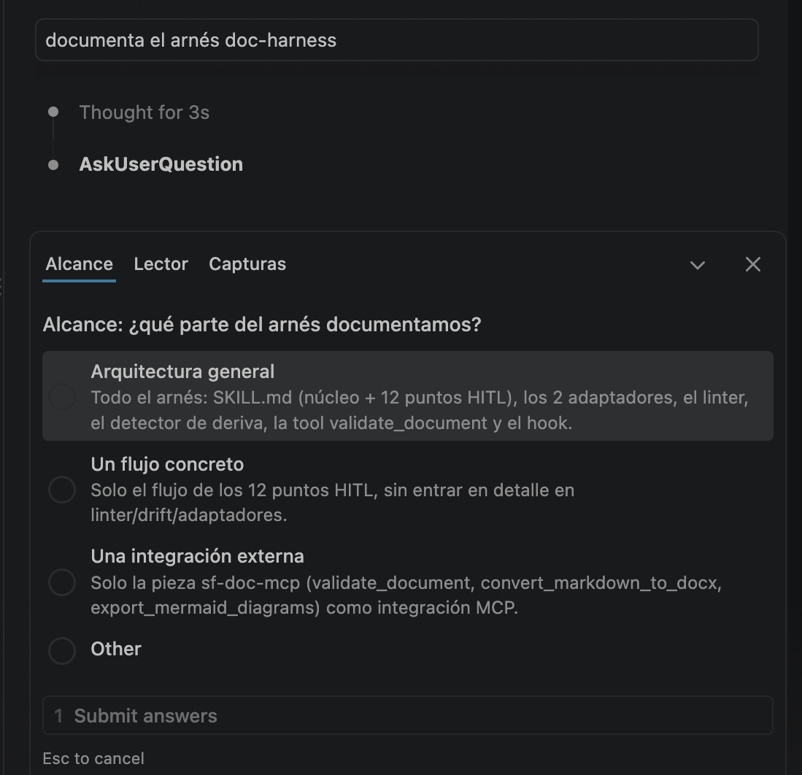

Este es el arranque real del ciclo: un mensaje corto en lenguaje natural dispara el paso 1 del arnés (Brief inicial), que agrupa varias preguntas estructuradas en una sola interacción en vez de una detrás de otra — la pestaña **Alcance** es la primera de las tres (Alcance, Lector, Capturas) que resuelve el mismo cuadro de diálogo.

### 2.2 Confirmando el lector objetivo {#recorrido-02}

```{=openxml}
<w:p><w:pPr><w:keepNext/></w:pPr></w:p>
```

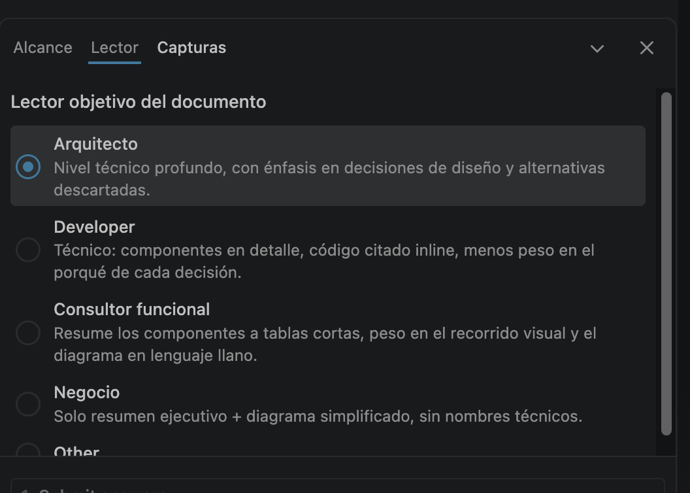

La pestaña **Lector** es el punto 3 de los 12 — determina el nivel de detalle del documento final (ver la tabla lector→nivel en [7.1](#componente-skill)). Aquí se eligió **Arquitecto**, que es justo el nivel al que está escrito este propio documento: énfasis en decisiones de diseño y alternativas descartadas, no solo en el cómo.

### 2.3 Confirmando las capturas {#recorrido-03}

```{=openxml}
<w:p><w:pPr><w:keepNext/></w:pPr></w:p>
```

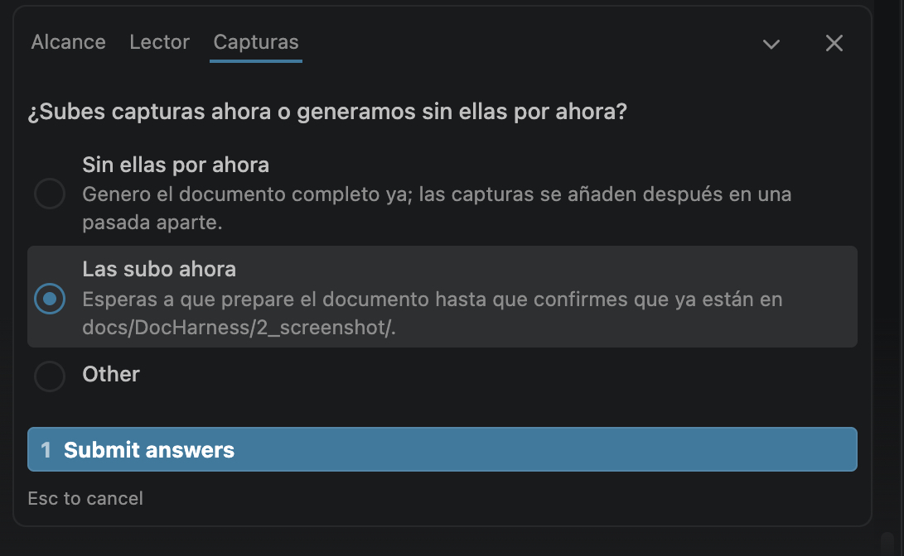

Última pestaña del brief: si el usuario elige "las subo ahora", el arnés espera una confirmación explícita antes de seguir al paso 2 — no asume que las capturas están listas solo porque ha pasado tiempo.

### 2.4 La estructura real del arnés en disco {#recorrido-04}

```{=openxml}
<w:p><w:pPr><w:keepNext/></w:pPr></w:p>
```

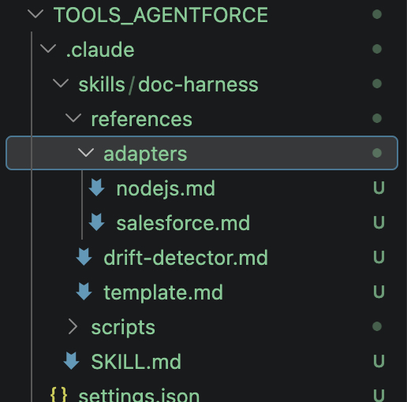

Esta captura muestra la estructura de ficheros real que describe este documento — no una representación simplificada. La marca **U** junto a cada fichero confirma que, en el momento de la captura, todo el arnés era código nuevo sin comitear todavía (ver [Modelo de seguridad](#modelo-seguridad) para el estado de control de versiones).

### 2.5 El brief confirmado {#recorrido-05}

```{=openxml}
<w:p><w:pPr><w:keepNext/></w:pPr></w:p>
```

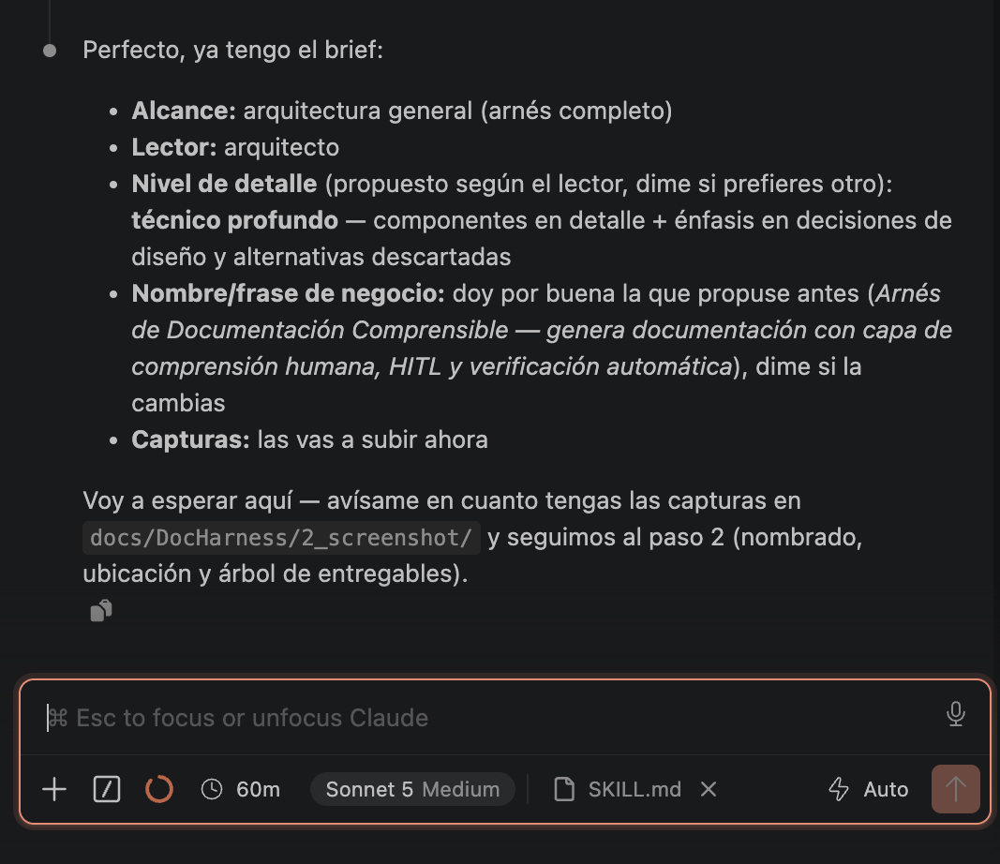

Cierre del momento 1: el arnés recapitula todo lo acordado en una sola respuesta antes de tocar ningún fichero real, y queda a la espera — en este caso, de que las capturas terminaran de subirse — antes de avanzar al momento 2 (nombrado y árbol de entregables).

### 2.6 Revisando las capturas antes de usarlas {#recorrido-06}

```{=openxml}
<w:p><w:pPr><w:keepNext/></w:pPr></w:p>
```

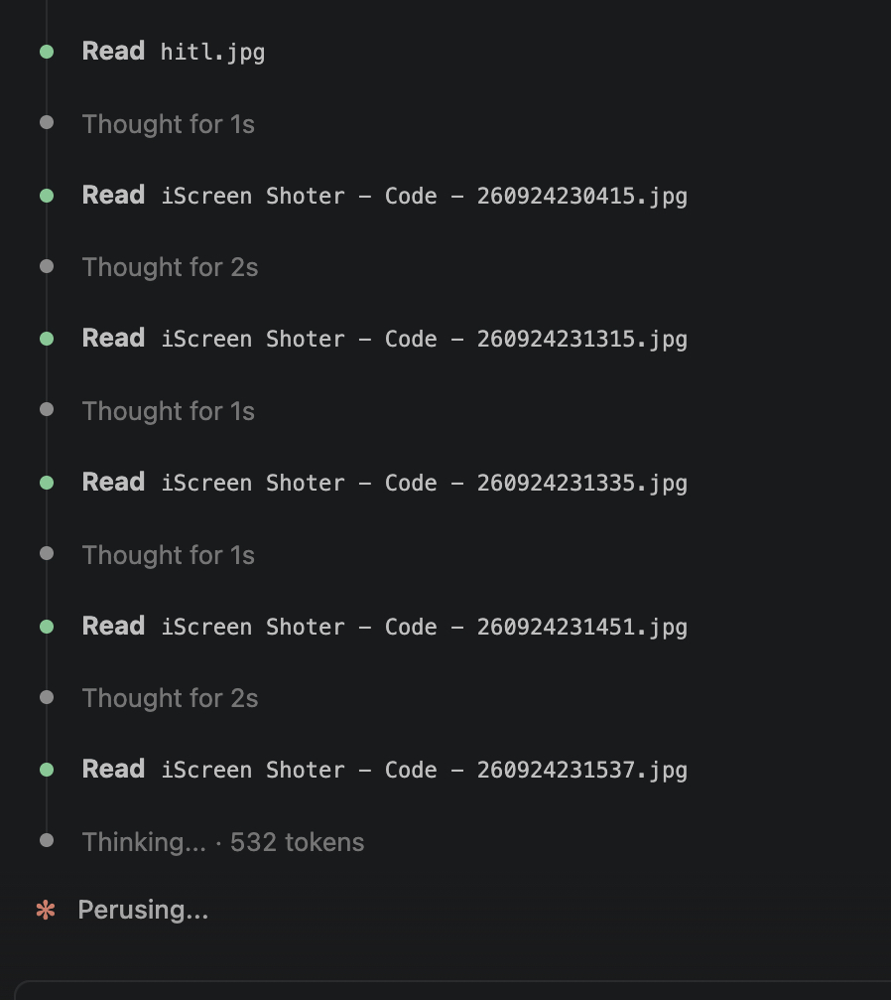

Punto 10 de los 12 en acción: antes de incorporar ninguna captura a la documentación, el arnés las abre y las lee todas, una a una — nunca infiere qué muestra una imagen por su nombre de fichero.

### 2.7 Árbol de entregables propuesto {#recorrido-07}

```{=openxml}
<w:p><w:pPr><w:keepNext/></w:pPr></w:p>
```

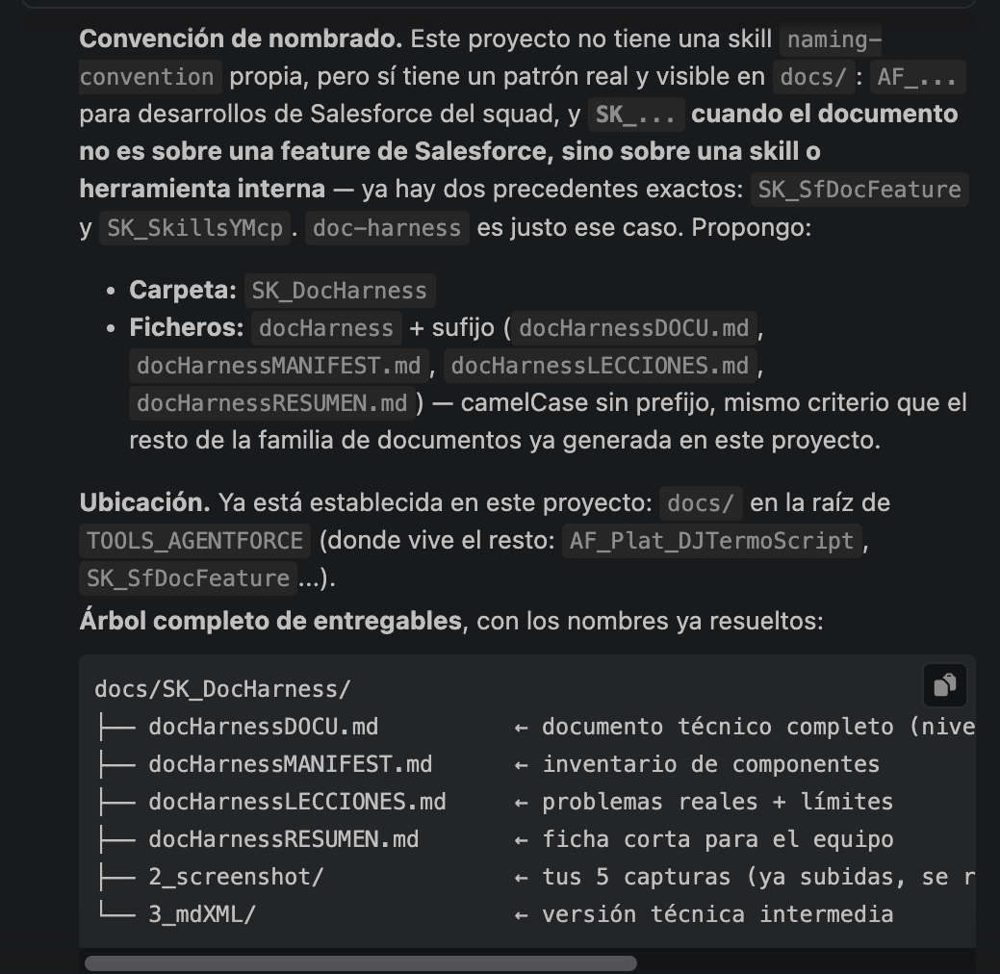

El punto 8 de los 12: el árbol completo de entregables, con los nombres ya resueltos, mostrado antes de crear ningún fichero real — exactamente el mecanismo que describe [7.1](#componente-skill).

### 2.8 Resumen de las capturas ya revisadas {#recorrido-08}

```{=openxml}
<w:p><w:pPr><w:keepNext/></w:pPr></w:p>
```

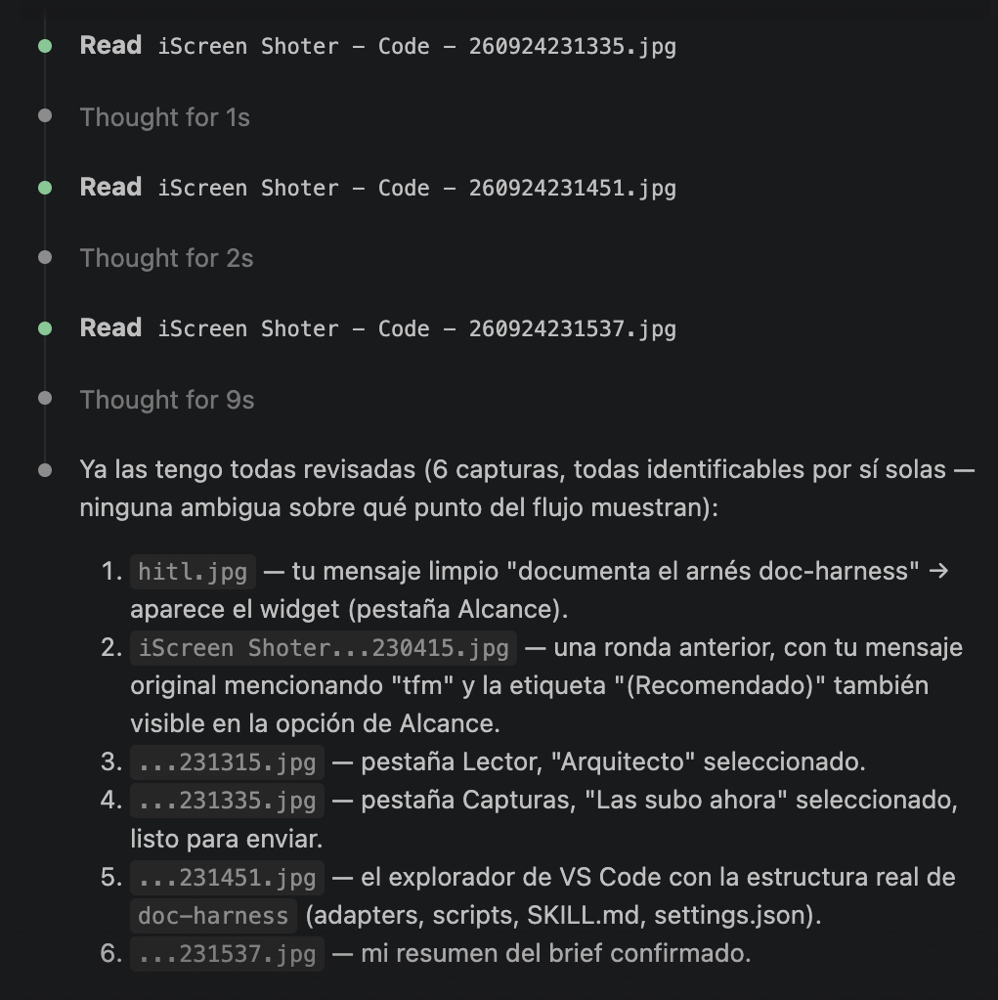

Consecuencia directa del paso 2.6: una vez leídas, el arnés confirma en una lista corta qué ha entendido de cada captura — el punto en el que una interpretación equivocada se detectaría antes de usarla.

### 2.9 El hallazgo en vivo: falta un adaptador {#recorrido-09}

```{=openxml}
<w:p><w:pPr><w:keepNext/></w:pPr></w:p>
```

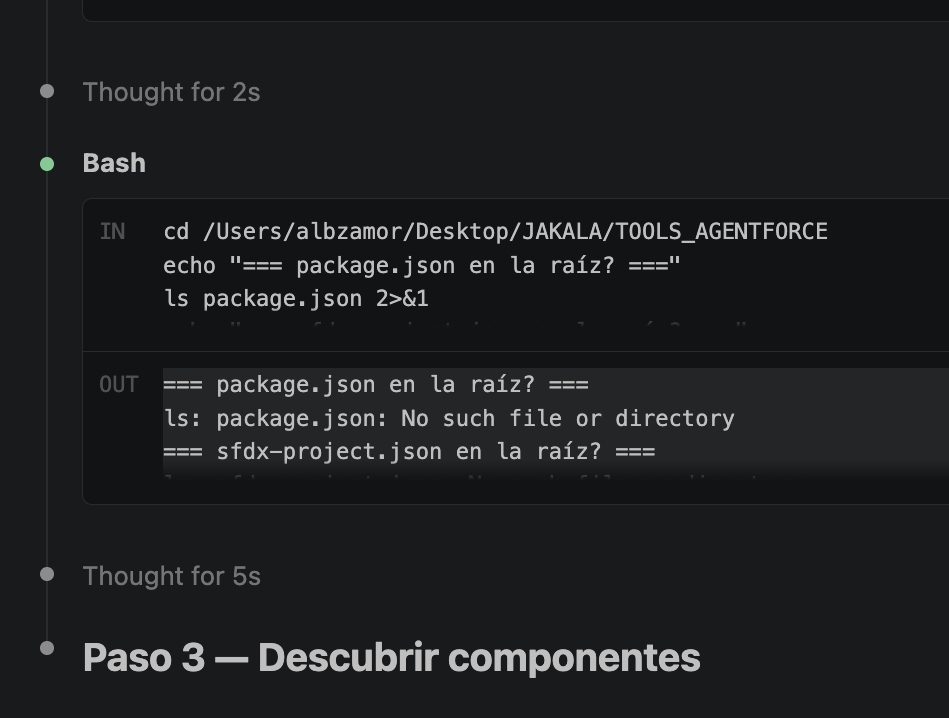

El momento exacto del Problema 3 de [LECCIONES](docHarnessLECCIONES.md): una comprobación real, no supuesta, de que ni el adaptador de Salesforce ni el de Node.js encajan con el propio `doc-harness`.

### 2.10 Confirmando la tabla de componentes {#recorrido-10}

```{=openxml}
<w:p><w:pPr><w:keepNext/></w:pPr></w:p>
```

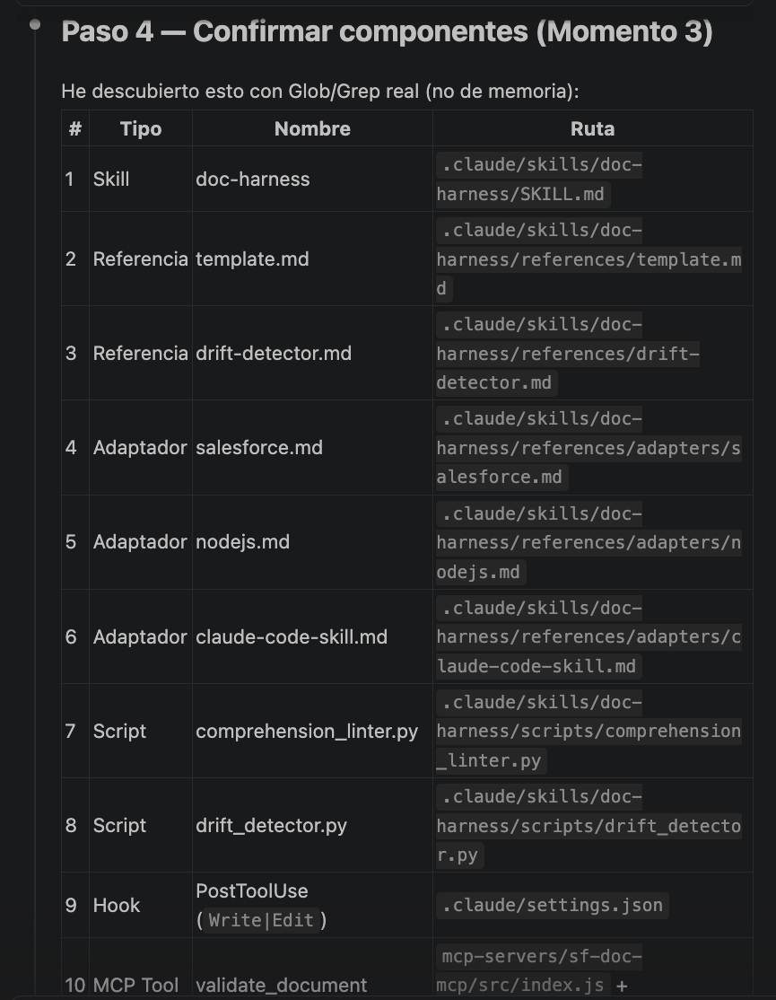

Punto 9 de los 12: la lista completa de componentes reales, con ruta exacta, presentada para confirmación explícita antes de escribir el MANIFEST — es la tabla que terminó en la sección [4](#inventario-componentes) de este mismo documento.

### 2.11 Escribiendo el MANIFEST {#recorrido-11}

```{=openxml}
<w:p><w:pPr><w:keepNext/></w:pPr></w:p>
```

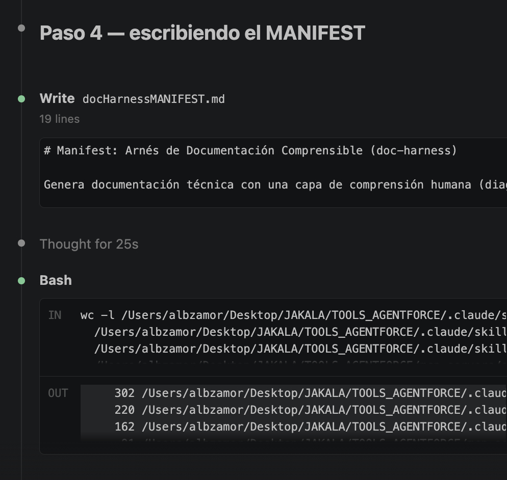

El paso de escritura real — no una simulación de lo que "se escribiría" — junto con una comprobación de líneas reales de cada componente antes de citar cifras en este documento.

### 2.12 El linter detecta el diagrama sin exportar {#recorrido-12}

```{=openxml}
<w:p><w:pPr><w:keepNext/></w:pPr></w:p>
```


El linter fallando de verdad contra este mismo documento en construcción — no un ejemplo preparado aparte — y la corrección inmediata exportando el diagrama antes de continuar. Ver [Guía de pruebas](#guia-pruebas).

### 2.13 Paso 8 — Revisión de cierre {#recorrido-13}

```{=openxml}
<w:p><w:pPr><w:keepNext/></w:pPr></w:p>
```

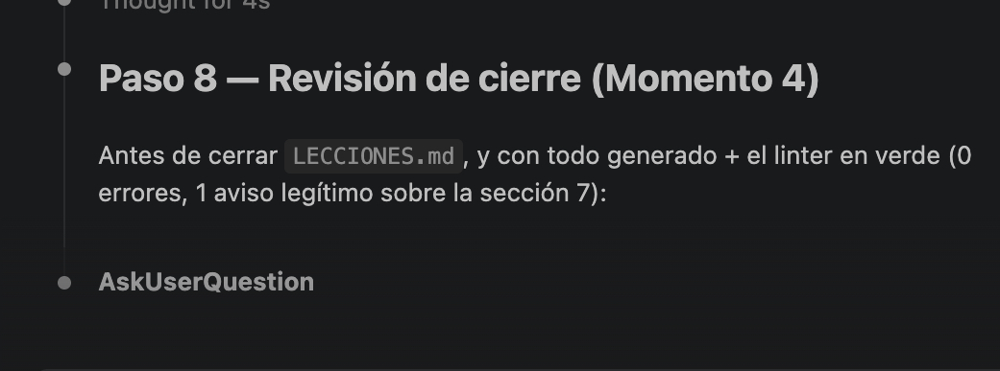

El paso 8 del flujo entrando en el momento 4: con el error de la captura anterior ya resuelto y el linter en verde, el arnés pasa a preparar el resumen de cierre — documentos generados, resultado del linter y párrafos explicativos — antes de lanzar la pregunta 11-12.

### 2.14 El cierre real: respuesta libre del usuario {#recorrido-14}

```{=openxml}
<w:p><w:pPr><w:keepNext/></w:pPr></w:p>
```

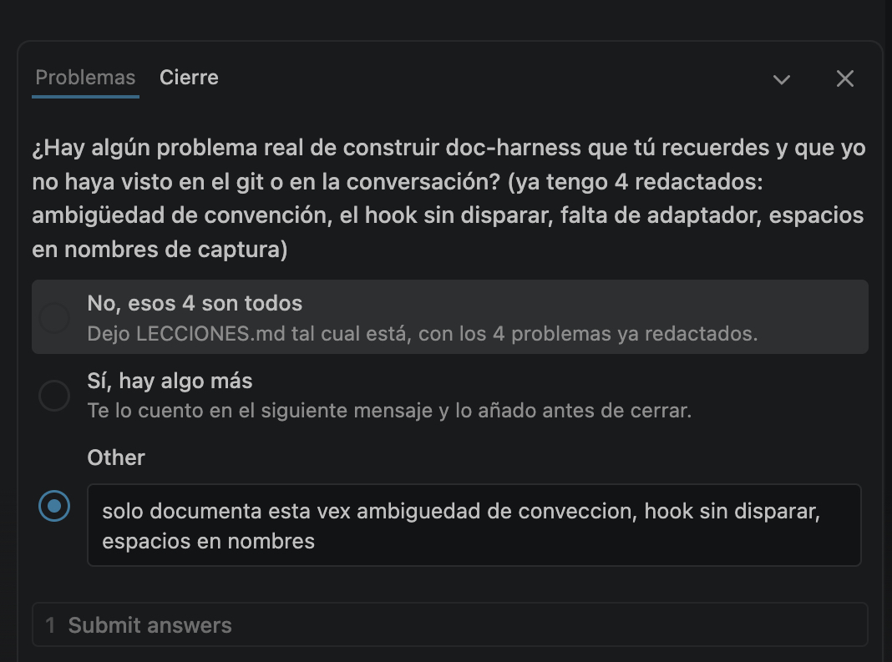

Punto 12 de los 12: la pregunta de cierre sobre problemas reales, resuelta con una respuesta libre del usuario que decidió, de los 4 problemas propuestos, cuáles quedaban — este mismo documento refleja esa decisión (ver [LECCIONES](docHarnessLECCIONES.md), que solo tiene 3).

```{=openxml}
<w:p><w:r><w:br w:type="page"/></w:r></w:p>
```

## 3. Arquitectura de la solución {#arquitectura}

### 3.1 Diagrama de arquitectura {#arquitectura-diagrama}

```{=openxml}
<w:p><w:pPr><w:keepNext/></w:pPr></w:p>
```

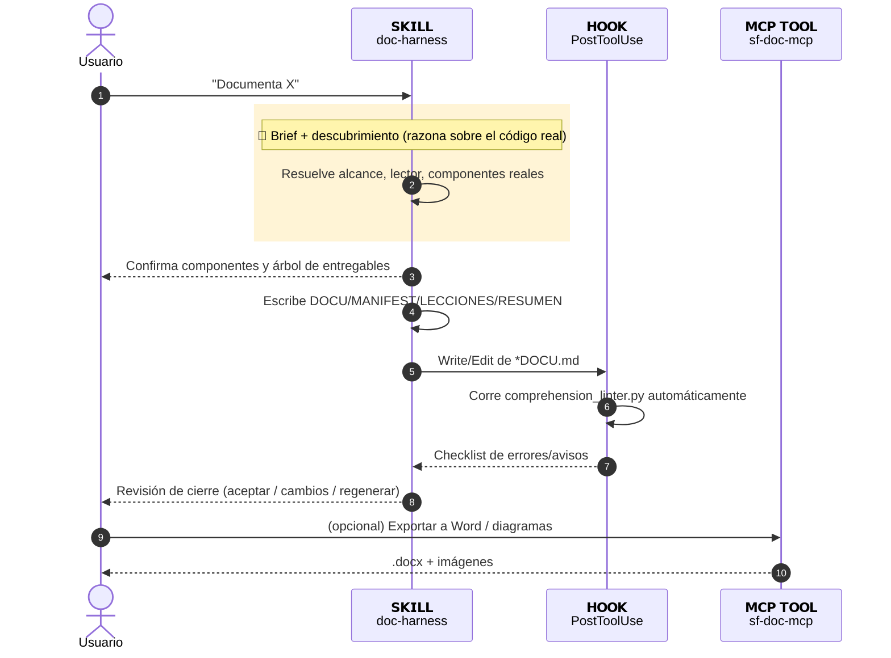

> El propio ciclo que generó este documento es una instancia real de este diagrama — no un caso hipotético.

### 3.2 Decisiones de diseño clave {#arquitectura-decisiones}

```{=openxml}
<w:p><w:pPr><w:keepNext/></w:pPr></w:p>
```

| Decisión | Alternativa descartada | Motivo |
|---|---|---|
| Núcleo agnóstico + adaptadores intercambiables | Un único fichero con todo el conocimiento de cada stack mezclado | Añadir un stack nuevo no toca el núcleo — probado en vivo con 3 adaptadores reales, el tercero creado durante esta misma sesión de documentación |
| 12 puntos HITL agrupados en 4 momentos | Una sola confirmación al final, o preguntarlo todo de golpe al principio | Evita tanto la parálisis de preguntas como las decisiones silenciosas — cada punto para justo cuando hace falta el criterio humano |
| La convención de nombrado solo nombra los ficheros de documentación, nunca los componentes documentados | Aplicar la convención también al citar los componentes | Evita que la documentación "mienta" sobre cómo se llama algo en el repo real — un componente legado sin prefijo se documenta con su nombre real, con una nota, nunca renombrado |
| El linter corre como hook automático, no solo como instrucción en `SKILL.md` | Confiar en que el modelo se acuerde de ejecutarlo | Un hook es una garantía del arnés; una instrucción es una petición al modelo, que puede olvidarse en una conversación larga |
| El detector de deriva es una comprobación aparte, no parte de la generación | Comprobar deriva automáticamente en cada generación | Compara contra un repo de código que puede ser distinto del repo de documentación — acoplarlo a la generación complica el flujo sin necesidad real |
| El MCP solo hace tareas deterministas (formato, validación), nunca razona qué componentes existen | Un servidor MCP con tools de `analyze_project`/`inspect_component` | Un tool programático no puede razonar tan bien como un agente con Grep/Glob reales — se evaluó y descartó explícitamente una propuesta con más tools MCP durante el diseño |
| `validate_document` envuelve el script Python existente en vez de reimplementar su lógica en JavaScript | Reescribir las 4 reglas del linter en el propio servidor MCP | Evita dos fuentes de verdad del mismo comportamiento; un cambio en las reglas solo se hace en un sitio |

```{=openxml}
<w:p><w:r><w:br w:type="page"/></w:r></w:p>
```

## 4. Inventario de componentes {#inventario-componentes}

```{=openxml}
<w:p><w:pPr><w:keepNext/></w:pPr></w:p>
```

| # | Tipo | Nombre | Ruta | Función |
|---|---|---|---|---|
| 1 | Skill | doc-harness | `.claude/skills/doc-harness/SKILL.md` | Núcleo: proceso completo, 12 puntos HITL, formatos de salida |
| 2 | Referencia | template.md | `.claude/skills/doc-harness/references/template.md` | Estructura y reglas de formato de la familia de 4 documentos |
| 3 | Referencia | drift-detector.md | `.claude/skills/doc-harness/references/drift-detector.md` | Uso e interpretación del detector de deriva |
| 4 | Adaptador | salesforce.md | `.claude/skills/doc-harness/references/adapters/salesforce.md` | Tipos de componente y convención para proyectos Salesforce DX |
| 5 | Adaptador | nodejs.md | `.claude/skills/doc-harness/references/adapters/nodejs.md` | Tipos de componente y convención para proyectos Node.js/JS |
| 6 | Adaptador | claude-code-skill.md | `.claude/skills/doc-harness/references/adapters/claude-code-skill.md` | Tipos de componente para skills/plugins de Claude Code — creado durante esta misma sesión |
| 7 | Script | comprehension_linter.py | `.claude/skills/doc-harness/scripts/comprehension_linter.py` | Verifica anchors, diagramas exportados, capturas explicadas, ratio visual |
| 8 | Script | drift_detector.py | `.claude/skills/doc-harness/scripts/drift_detector.py` | Compara la fecha de última actualización contra el git real de cada componente |
| 9 | Hook | PostToolUse (`Write\|Edit`) | `.claude/settings.json` | Dispara el linter automáticamente al escribir/editar un `*DOCU.md` |
| 10 | MCP Tool | validate_document | `mcp-servers/sf-doc-mcp/src/index.js` + `validateDocument.js` | Envuelve el linter para poder correrlo fuera de Claude Code |

## 5. Modelo de datos {#modelo-datos}

```{=openxml}
<w:p><w:pPr><w:keepNext/></w:pPr></w:p>
```

No aplica — el arnés no crea ningún Custom Object ni modelo de datos propio. Su "estado" son los propios ficheros Markdown que genera y los repos de código que audita.

```{=openxml}
<w:p><w:r><w:br w:type="page"/></w:r></w:p>
```

## 6. Modelo de seguridad {#modelo-seguridad}

```{=openxml}
<w:p><w:pPr><w:keepNext/></w:pPr></w:p>
```

| Aspecto | Detalle |
|---|---|
| Control de versiones | En el momento de este documento, todo el arnés (`.claude/`, `docs/`, `validateDocument.js`) está sin comitear en `TOOLS_AGENTFORCE` — ver la captura de [2.4](#recorrido-04) |
| Alcance del hook | El comando del hook solo actúa sobre ficheros cuyo nombre termina en `DOCU.md` — no toca ningún otro `Write`/`Edit` de la sesión |
| Alcance de ejecución del hook | Solo dispara en una sesión de Claude Code que tenga este repo como raíz real del proyecto — ver [Problema real documentado](../../../ARNES_COMPRENSION.md#problema-hooks-directorio-adicional) |
| Secretos | Ninguno — el arnés no maneja credenciales; los scripts solo leen ficheros Markdown y metadatos de git |
| Permisos del MCP | `validate_document` ejecuta `python3` como subproceso del propio servidor MCP — hereda los permisos del proceso que lo lanza, no escala privilegios |

```{=openxml}
<w:p><w:r><w:br w:type="page"/></w:r></w:p>
```

## 7. Componentes en detalle {#componentes-detalle}

### 7.1 SKILL.md — el núcleo agnóstico {#componente-skill}

```{=openxml}
<w:p><w:pPr><w:keepNext/></w:pPr></w:p>
```

302 líneas. Define el frontmatter que activa la skill, los 12 puntos HITL (tabla completa reproducida en la introducción del propio fichero) y el flujo de 10 pasos numerados (0 a 10). Extracto del frontmatter:

```yaml
---
name: doc-harness
description: Genera documentación de una feature con una capa deliberada de comprensión humana...
tools: Read, Write, Edit, Bash, Glob, Grep
---
```

El paso que más distingue a este arnés de un generador de documentación convencional es el 2, que exige mostrar el árbol completo de entregables **antes** de crear nada:

```
docs/<CarpetaFeature>/
├── <nombreFeature>DOCU.md
├── <nombreFeature>MANIFEST.md
├── <nombreFeature>LECCIONES.md
├── <nombreFeature>RESUMEN.md
├── 2_screenshot/
└── 3_mdXML/
```

La tabla lector→nivel de detalle (usada para resolver la pregunta 4 de esta misma generación) vive también en este fichero:

| Lector | Nivel sugerido | Qué cambia |
|---|---|---|
| Developer | Técnico | Componentes en detalle completo, código inline |
| Arquitecto | Técnico profundo | + énfasis en decisiones de diseño y alternativas descartadas |
| Consultor funcional | Funcional | Componentes resumidos a tabla corta |
| Negocio | Ejecutivo | Solo resumen ejecutivo + diagrama simplificado |

### 7.2 Adaptadores {#componente-adaptadores}

```{=openxml}
<w:p><w:pPr><w:keepNext/></w:pPr></w:p>
```

Tres ficheros, mismo patrón interno cada uno: detección del stack, tabla de tipos de componente, convención de nombrado (con la misma regla — nunca renombrar componentes), tabla Mermaid de tipos en Unicode Sans-Bold, y manejo de errores propio del stack. El tercero, `claude-code-skill.md`, se escribió durante esta misma generación tras comprobar que ni `salesforce.md` ni `nodejs.md` encajaban con el propio `doc-harness` — su detección se fundamentó en tres skills reales (`doc-harness`, `sf-doc-feature`, `naming-convention`), no solo en una.

### 7.3 comprehension_linter.py — la pieza estrella {#componente-linter}

```{=openxml}
<w:p><w:pPr><w:keepNext/></w:pPr></w:p>
```

220 líneas, Python puro (sin dependencias externas). Cuatro reglas, cada una como función independiente:

```python
def check_anchors(text):
    defined = set(ANCHOR_DEF_RE.findall(text))
    used = set(ANCHOR_USE_RE.findall(text))
    missing = used - defined
    ...

def check_diagrams(text, feature_dir):
    mermaid_blocks = MERMAID_BLOCK_RE.findall(text)
    ...
    if n_images < n_blocks:
        findings.append(Finding("error", "DIAGRAMS", ...))
```

`check_screenshots` exige un párrafo de al menos `--min-caption-words` (12 por defecto) justo debajo de cada imagen de `2_screenshot/`; `check_visual_ratio` es la única regla no bloqueante — avisa, no falla, si una sección de más de 40 líneas no tiene ningún diagrama ni captura. Probado con datos reales: 0 errores/2 avisos contra `djTermoScriptDOCU.md`, y 3/3 errores detectados correctamente contra un documento roto a propósito (ver [Guía de pruebas](#guia-pruebas)).

### 7.4 drift_detector.py {#componente-drift}

```{=openxml}
<w:p><w:pPr><w:keepNext/></w:pPr></w:p>
```

162 líneas. Recibe `--doc`, `--manifest` y `--source-repo` (casi siempre distinto del repo de la documentación) y, para cada componente del MANIFEST, compara su último commit real (`git log -1 --format=%cI`) contra la fecha "Última actualización" del DOCU:

```python
def git_last_commit_date(repo: Path, path: str):
    result = subprocess.run(
        ["git", "-C", str(repo), "log", "-1", "--format=%cI", "--", path],
        capture_output=True, text=True,
    )
```

Cuando un componente no tiene historial de git en esa ruta, lo reporta como `?` en vez de asumir "sin deriva" — distingue explícitamente entre "el código no ha cambiado" y "no sé si ha cambiado porque nunca se comiteó".

### 7.5 El hook PostToolUse {#componente-hook}

```{=openxml}
<w:p><w:pPr><w:keepNext/></w:pPr></w:p>
```

Declarado en `.claude/settings.json`:

```json
{
  "hooks": {
    "PostToolUse": [{
      "matcher": "Write|Edit",
      "hooks": [{ "type": "command", "command": "..." }]
    }]
  }
}
```

El comando filtra por sufijo `*DOCU.md` con un `case` de shell, corre `comprehension_linter.py` contra el fichero exacto, y devuelve el resultado como `hookSpecificOutput.additionalContext` — el propio protocolo de hooks de Claude Code inyecta ese texto de vuelta en la conversación sin que nadie lo pida. Confirmado disparando en vivo dos veces, con evidencia de fichero centinela (ver [Guía de pruebas](#guia-pruebas)) — tras diagnosticar que no disparaba porque la sesión no tenía este repo como raíz real del proyecto, no por ningún fallo del propio comando.

### 7.6 validate_document (tool MCP) {#componente-mcp}

```{=openxml}
<w:p><w:pPr><w:keepNext/></w:pPr></w:p>
```

`mcp-servers/sf-doc-mcp/src/validateDocument.js`, 91 líneas. Wrapper fino sobre `child_process.spawn("python3", ...)`:

```javascript
export async function validateDocument({ markdownPath, linterPath, minSectionLines, minCaptionWords }) {
  ...
  const { stdout, stderr, code } = await runPython(resolvedLinterPath, args);
  return { passed: code === 0, exitCode: code, output: stdout.trim() || stderr.trim(), linterPath: resolvedLinterPath };
}
```

`linterPath` es configurable — el valor por defecto asume la estructura de `TOOLS_AGENTFORCE`, pero un proyecto con otra disposición de carpetas puede pasar su propia ruta sin tocar el código. Registrado como quinta tool del servidor `sf-doc-mcp`, junto a `document_salesforce_project`, `document_feature`, `convert_markdown_to_docx` y `export_mermaid_diagrams`.

```{=openxml}
<w:p><w:r><w:br w:type="page"/></w:r></w:p>
```

## 8. Manejo de errores {#manejo-errores}

```{=openxml}
<w:p><w:pPr><w:keepNext/></w:pPr></w:p>
```

| Origen del error | Mecanismo de detección | Respuesta |
|---|---|---|
| Anchor roto en el DOCU | `check_anchors`: `]( #id)` sin `{#id}` correspondiente | Error bloqueante, línea no aplica (nivel documento) |
| Diagrama Mermaid sin exportar | `check_diagrams`: nº de bloques \`\`\`mermaid > nº de imágenes en `4_diagramas/` | Error bloqueante, indica cuántos faltan |
| Captura sin párrafo explicativo | `check_screenshots`: menos de `--min-caption-words` en las 5 líneas siguientes a la imagen | Error bloqueante, con nº de línea exacto |
| Sección larga sin apoyo visual | `check_visual_ratio` | Aviso, no bloqueante |
| `linterPath` no existe (tool MCP) | `validateDocument.js`: comprobación de fichero antes de invocar | Excepción clara con la ruta exacta y sugerencia de pasar `linterPath` |
| `markdownPath` no existe | Mismo mecanismo, en ambos (script y tool MCP) | Excepción clara antes de intentar nada |
| Componente sin historial de git (drift detector) | `git_last_commit_date` devuelve `None` | Se reporta como `?`, nunca como "sin deriva" |

## 9. Guía de despliegue {#guia-despliegue}

```{=openxml}
<w:p><w:pPr><w:keepNext/></w:pPr></w:p>
```

Este arnés no se "despliega" en el sentido de Salesforce — se **instala** copiando la carpeta en el proyecto destino:

```bash
cp -r .claude/skills/doc-harness <proyecto-destino>/.claude/skills/doc-harness
```

Si el proyecto destino quiere el hook automático, fusionar (nunca sobrescribir) el bloque `hooks.PostToolUse` de `.claude/settings.json` en el `settings.json` del proyecto destino — con rutas relativas al nuevo repo, o absolutas si se prefiere robustez frente al directorio de trabajo (ver [Modelo de seguridad](#modelo-seguridad)).

Si el proyecto destino usa `sf-doc-mcp` para exportar a Word/diagramas, la tool `validate_document` ya viaja incluida — no hace falta ningún paso adicional salvo que el proyecto no siga la misma disposición de carpetas (en ese caso, pasar `linterPath` explícito en cada llamada).

## 10. Configuración post-despliegue {#configuracion-post-despliegue}

```{=openxml}
<w:p><w:pPr><w:keepNext/></w:pPr></w:p>
```

1. **Confirmar que el hook dispara en vivo** en el proyecto destino: `/hooks` debe listarlo, y una edición real sobre un `*DOCU.md` debe mostrar la salida del linter. Si no aparece, comprobar primero que ese repo es la raíz real de la sesión — no un directorio de trabajo adicional.
2. **Ningún adaptador es obligatorio** — si el stack del proyecto destino no tiene uno, el arnés lo dice explícitamente y ofrece crear uno nuevo la primera vez que se use (como ocurrió con `claude-code-skill.md` en esta misma sesión).
3. Nada que configurar en `sf-doc-mcp` más allá de tener `pandoc` y Chrome/Chromium instalados si se va a exportar a Word o a PNG — ya documentado en la feature `AF_Plat_DJTermoScript`.

```{=openxml}
<w:p><w:r><w:br w:type="page"/></w:r></w:p>
```

## 11. Guía de pruebas {#guia-pruebas}

```{=openxml}
<w:p><w:pPr><w:keepNext/></w:pPr></w:p>
```

Todas las pruebas de esta sección son reales, ejecutadas durante la construcción del arnés — no un plan de pruebas hipotético:

**Linter — caso positivo:**

```bash
python3 .claude/skills/doc-harness/scripts/comprehension_linter.py \
  docs/AF_Plat_DJTermoScript/djTermoScriptDOCU.md
# → 0 error(es), 2 aviso(s)
```

**Linter — caso negativo** (documento con anchor roto, diagrama sin exportar, y captura sin párrafo explicativo, construido a propósito):

```text
3 error(es), 0 aviso(s).  # exit code 1
```

**Tool MCP `validate_document`** — probada llamando a la función real (sin pasar por el protocolo MCP completo): caso positivo, caso negativo, y `linterPath` inválido con mensaje de error claro.

**Detector de deriva** contra `AGENTFORCE_SANDBOX` real: 3 componentes sin deriva, 2 sin historial de git (el propio `.agent` de `AF_Plat_DJTermoScript`, nunca comiteado) — hallazgo genuino, no preparado.

**Hook en vivo** — la prueba más costosa de las cuatro: se diagnosticó con un fichero centinela (`echo ... >> /tmp/claude-hook-check.txt`, independiente de cualquier salida que Claude Code decida mostrar) que el hook no disparaba en una sesión con `AGENTFORCE_SANDBOX` como raíz. Se aisló la causa copiando temporalmente el hook (ruta absoluta) a `AGENTFORCE_SANDBOX/.claude/settings.local.json` — con eso, dos disparos confirmados, con dos marcas de tiempo reales en el centinela. La copia temporal se retiró después; detalle completo en [ARNES_COMPRENSION.md](../../../ARNES_COMPRENSION.md#problema-hooks-directorio-adicional).

## 12. Referencias {#referencias}

```{=openxml}
<w:p><w:pPr><w:keepNext/></w:pPr></w:p>
```

**Documentos relacionados:** [Manifest de componentes](../docHarnessMANIFEST.md) · [Lecciones aprendidas](docHarnessLECCIONES.md) · [Resumen para el equipo](docHarnessRESUMEN.md) · [Arquitectura completa del arnés](../../../ARNES_COMPRENSION.md).

**Documentación oficial de Anthropic/Claude Code:**

- [Claude Code — Hooks reference](https://docs.claude.com/en/docs/claude-code/hooks)
- [Claude Code — Skills](https://docs.claude.com/en/docs/claude-code/skills)
- [Model Context Protocol — Introduction](https://modelcontextprotocol.io/introduction)
