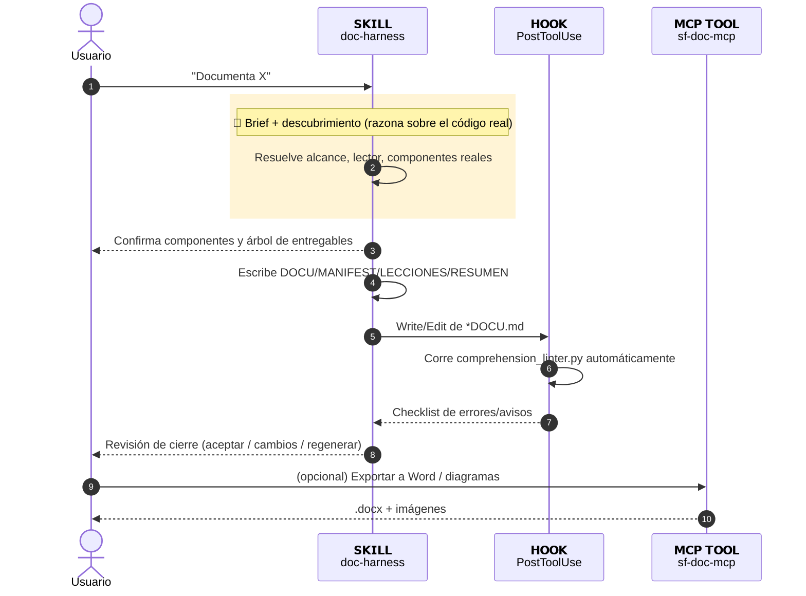

# Resumen Arnés de Documentación Comprensible

| | |
|---|---|
| **Feature** | Arnés de Documentación Comprensible (doc-harness) |
| **Squad** | Herramientas internas |
| **Estado** | Construido y probado con datos reales; hook confirmado en vivo |
| **Org** | No aplica |
| **Documento técnico completo** | [docHarnessDOCU.md](./docHarnessDOCU.md) |

## Qué hace

Genera documentación técnica de cualquier proyecto con una capa pensada para que un humano la entienda rápido (diagramas, capturas explicadas, adaptada a quién la lee), no solo una capa de texto para que otra IA la indexe — con verificación automática de que esa capa humana está realmente completa.

## Cómo funciona (en 5 pasos)

1. Se acuerda con el usuario qué documentar, para quién y con qué nivel de detalle, antes de tocar el proyecto.
2. Se confirma cómo se van a llamar los ficheros y qué estructura se va a crear, antes de crear nada.
3. Se descubren los componentes reales del proyecto y se confirman con el usuario antes de escribir.
4. Se escribe la documentación completa, con diagramas y capturas explicadas.
5. Un verificador automático comprueba que la capa humana está completa antes de cerrar — y el usuario revisa y decide si acepta, pide cambios, o se regenera algo.

```{=openxml}
<w:p><w:pPr><w:keepNext/></w:pPr></w:p>
```

## Diagrama de arquitectura



## Componentes creados

| Tipo | Nombre |
|---|---|
| Skill | doc-harness |
| Adaptador | salesforce.md |
| Adaptador | nodejs.md |
| Adaptador | claude-code-skill.md |
| Script | comprehension_linter.py |
| Script | drift_detector.py |
| Hook | PostToolUse |
| MCP Tool | validate_document |

## Dónde ampliar información

Documentación técnica completa en [docHarnessDOCU.md](./docHarnessDOCU.md) · lista de componentes en [docHarnessMANIFEST.md](../docHarnessMANIFEST.md) · problemas reales encontrados en [docHarnessLECCIONES.md](./docHarnessLECCIONES.md) · arquitectura completa del arnés en [ARNES_COMPRENSION.md](../../../ARNES_COMPRENSION.md).
