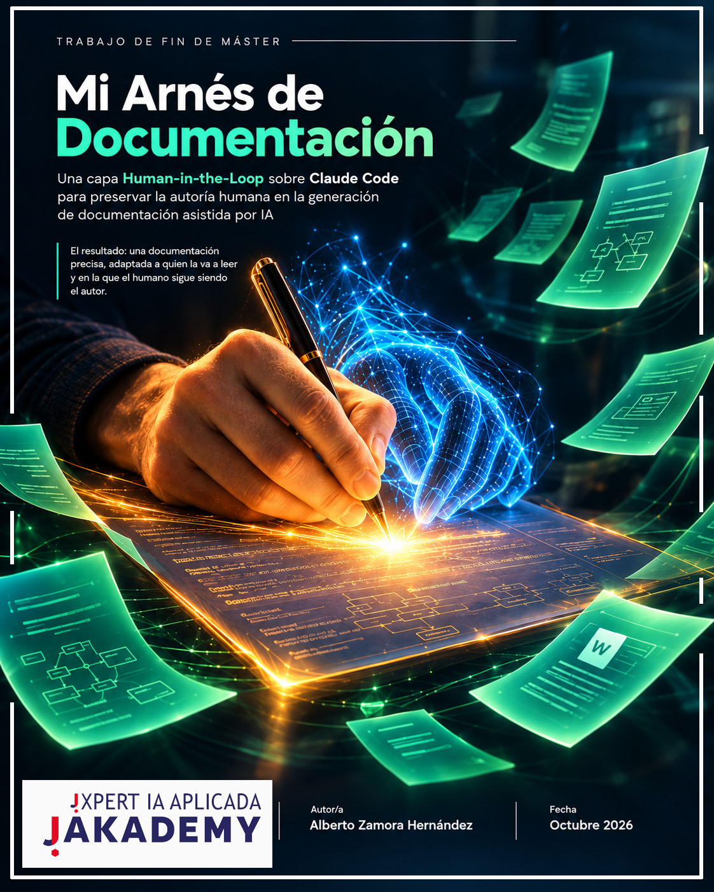
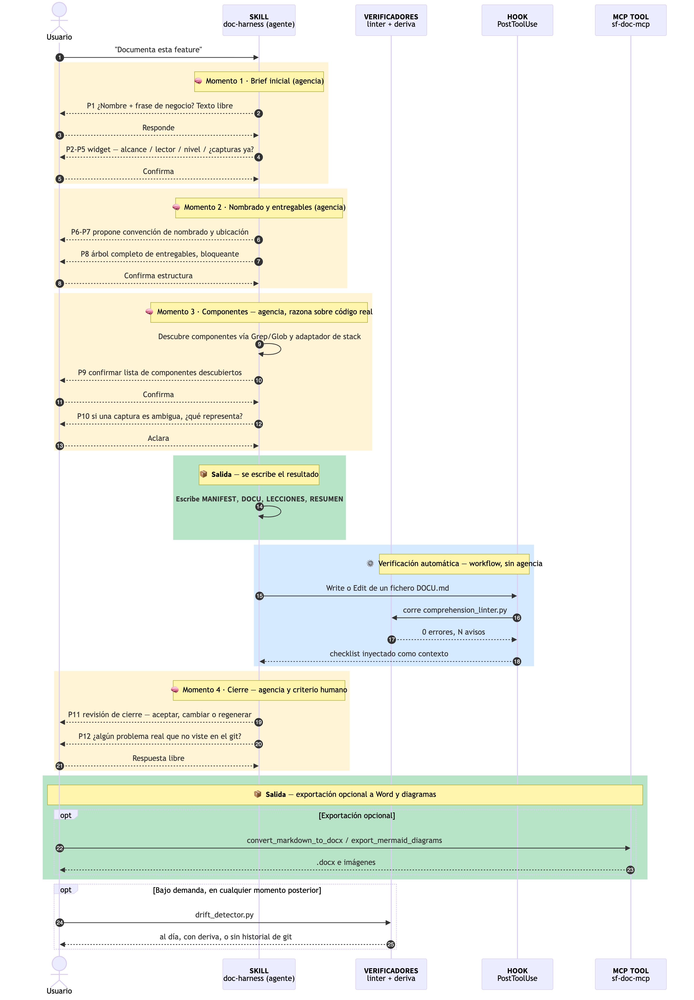
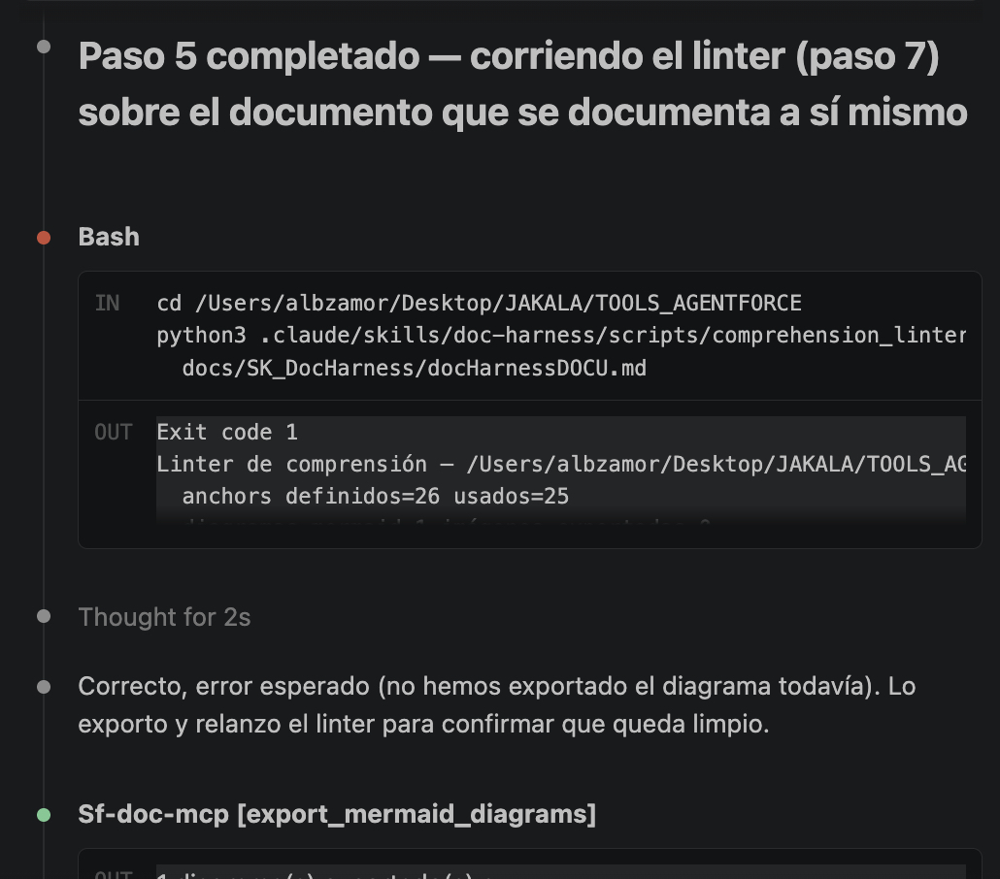

{width=100%}

```{=openxml}
<w:p><w:r><w:br w:type="page"/></w:r></w:p>
```

## Resumen

Un modelo de lenguaje genera documentación técnica más rápido de lo que una
persona puede leerla y, sobre todo, más rápido de lo que puede *decidirla*.
Este trabajo parte de unas primeras versiones de una skill que documentaba
features de un proyecto de agentes de Salesforce, y las convierte en un
arnés con el humano en el centro: doce decisiones que solo una persona puede
tomar, agrupadas en cuatro momentos, y dos verificadores deterministas que
comprueban que el resultado es comprensible y sigue al día. La pregunta de
fondo es cómo hacer que una IA escriba más rápido sin que el humano deje de
ser el autor de lo que se cuenta.

## Índice

1. [Contexto y problema](#contexto)
2. [Objetivo y alcance](#objetivo)
3. [Solución](#solucion)
   - [3.1 De dónde parte este trabajo](#origen)
   - [3.2 Lenguaje visual y plantilla única](#homogeneizacion)
   - [3.3 Arquitectura: skills y adaptadores](#arq)
   - [3.4 Los 12 puntos de decisión humana](#hitl)
   - [3.5 Verificación determinista: linter, deriva y hook](#verificadores)
4. [Verificación y resultados](#verificacion)
   - [4.1 Caso real: el arnés documentándose a sí mismo](#caso-real)
   - [4.2 Cómo se ha verificado](#experimento)
5. [Justificación de negocio](#negocio)
   - [5.1 El coste real de construir el arnés](#coste-construccion)
   - [5.2 Una sola forma para toda la documentación](#valor-homogeneo)
   - [5.3 Escenario ilustrativo](#escenario)
   - [5.4 Cuándo compensa la inversión](#amortizacion)
6. [Reutilización](#reutilizacion)
7. [Conclusiones](#conclusiones)
8. [Anexos](#anexos)

```{=openxml}
<w:p><w:r><w:br w:type="page"/></w:r></w:p>
```

## 1. Contexto y problema {#contexto}

```{=openxml}
<w:p><w:pPr><w:keepNext/></w:pPr></w:p>
```

Trabajo a diario documentando features reales de un proyecto de agentes
conversacionales construidos sobre Salesforce Agentforce: Agent Script,
Flows, Apex y componentes de interfaz. Para hacerlo uso una skill de Claude
Code que descubre esos componentes razonando sobre el código y escribe la
documentación en Markdown con diagramas.

El problema que motiva este trabajo tiene dos caras. La primera es conocida
y se agrava con los LLM: un modelo genera quince páginas técnicamente
correctas en el tiempo que una persona tarda en leer la primera. Si esa
documentación no tiene diagramas ni capturas explicadas, y no distingue si
la lee alguien que programa o alguien de negocio, es completa para otra IA
que la indexe y casi inútil para quien necesita la respuesta en treinta
segundos.

La segunda cara es menos visible y más grave. Si el proceso no deja ningún
hueco explícito para el criterio humano —el porqué de negocio, el alcance
que importa, un problema real que no dejó rastro en git—, la persona deja de
ser autora de su documentación y pasa a ser su correctora. Y quien revisa
contenido generado más rápido de lo que puede pensarlo tiende, con el
tiempo, a dejar de revisar de verdad.

Tres incidentes reales, encontrados al documentar distintos agentes, motivan
el diseño (detallados en
[docHarnessLECCIONES.md](../../SK_DocHarness/docHarnessLECCIONES.md)):

- Una convención de nombrado del proyecto se confundió con una regla para
  *corregir* el nombre de los componentes documentados. De haberse
  ejecutado, la documentación habría dejado de reflejar el código real.
- Un hook de verificación no disparaba en ninguna prueba, y la causa no era
  la sintaxis sino una condición de sesión invisible.
- Capturas subidas con nombres de sistema, con espacios sin codificar, que
  podían romper la conversión a Word sin que nadie lo notara hasta el final.

Ninguno de los tres es un fallo de la IA generando texto incorrecto. Los
tres son fallos de un proceso sin puntos explícitos de decisión y
verificación en los lugares correctos.

## 2. Objetivo y alcance {#objetivo}

```{=openxml}
<w:p><w:pPr><w:keepNext/></w:pPr></w:p>
```

**Objetivo.** Convertir el sistema de documentación que ya tenía en marcha
en un arnés completo que:

1. Genere, en una misma pasada sobre el código real, dos capas
   sincronizadas: una capa Markdown plana, para que otra IA la indexe, y una
   capa de comprensión humana (diagramas, capturas explicadas, adaptada al
   lector).
2. Mantenga siempre la misma forma y el mismo formato, sea cual sea la
   feature y quien la pida.
3. Mantenga al humano como autor de las decisiones que la IA no puede
   inferir de forma fiable, mediante puntos de decisión explícitos.
4. Verifique con reglas deterministas, y no con la confianza del modelo, que
   la capa humana está completa y sigue al día con el código.

**Alcance.** El trabajo cubre la base ya construida (la skill, sus
convenciones de diagrama y el servidor MCP de exportación) y la capa nueva:
los doce puntos de decisión humana, el linter de comprensión, el detector de
deriva, su integración mediante un hook y su exposición como herramienta
MCP. Queda fuera construir un motor de generación propio y ejecutar un
análisis empírico completo de comprensión fuera del squad, como se explica
en la [sección 4.2](#experimento).

**Qué significa "arnés" aquí.** Lo uso en el sentido de *test harness*, el
andamiaje que hace repetible un proceso, y no de *agent harness*: ese papel
ya lo cumple Claude Code. Este trabajo no lo sustituye; lo extiende con sus
propios mecanismos: una skill, un hook y un servidor MCP.

La decisión de diseño de fondo es dónde colocar cada cosa. La literatura
distingue **agente** (el modelo dirige su propio proceso y decide qué hacer
y cuándo) de **workflow** (el modelo y las herramientas siguen una ruta de
código predefinida). Este trabajo no elige uno de los dos: identifica en qué
puntos conviene cada uno. Las doce decisiones humanas y el descubrimiento de
componentes se dejan en manos del agente, porque ahí el criterio, humano o
del modelo razonando sobre código real, es insustituible. El linter y el
detector de deriva se construyen como workflow determinista, porque ahí no
hace falta criterio: hace falta una regla que se cumpla siempre igual.

## 3. Solución {#solucion}

```{=openxml}
<w:p><w:pPr><w:keepNext/></w:pPr></w:p>
```

### 3.1 De dónde parte este trabajo {#origen}

```{=openxml}
<w:p><w:pPr><w:keepNext/></w:pPr></w:p>
```

Nada de esto se improvisó en una tarde. Antes del máster ya tenía unas
primeras versiones del desarrollo: una skill que generaba documentación a
partir del código y poco más. Funcionaba, pero el proceso lo dirigía la IA
de principio a fin, y mi papel se reducía a revisar lo que salía.

Fue al avanzar en los contenidos y los conceptos del máster cuando vi que
eso no bastaba. Hacía falta un desarrollo más robusto y con otro centro de
gravedad: un proceso en el que la persona guía a la IA en cada decisión que
importa, y en el que el resultado se adapta a quien lo va a leer. A
principios de julio empecé a prepararlo. En agosto aquellas versiones
iniciales ya documentaban features completas, y desde entonces las he ido
mejorando y adaptando a mis necesidades reales, como desarrollador y a mi
propio squad.

El servidor MCP propio, `sf-doc-mcp`, llegó en una etapa posterior, cuando
detecté que para generar el documento final no hacía falta ni una skill ni
la IA: convertir el Markdown ya escrito en un `.docx` con buen aspecto, o
exportar un diagrama como imagen, es un trabajo mecánico que se puede hacer
en local y de forma determinista.

### 3.2 Lenguaje visual y plantilla única {#homogeneizacion}

```{=openxml}
<w:p><w:pPr><w:keepNext/></w:pPr></w:p>
```

Como hemos visto en el Máster es muy importante no omitir los elementos
visuales como capturas de pantalla y diagramas que siempre han sido la parte
central de las documentaciones. Aunque la IA no la necesite nosotros no
debemos perderlas ni dejar que pierdan peso en cada documentación.

Antes de asentarme en Mermaid para los diagramas probé otras vías: el ASCII
art se rompe en cuanto el diagrama crece, y cualquier herramienta de dibujo
manual rompe la promesa de generar todo el documento en la misma pasada.
Mermaid es texto: el modelo lo genera igual que cualquier otro bloque de
Markdown y se exporta como imagen de forma automática. Afinar el estilo
llevó varios días, hasta fijar tres reglas: los participantes se rotulan por
tipo de componente, las llamadas a un modelo de IA se resaltan con un fondo
de color para distinguir de un vistazo qué parte del flujo es determinista,
y el nivel de detalle del diagrama depende de lo que se documenta.

Toda la forma del documento vive en una única plantilla ([`template.md`]({{P
}}../../.claude/skills/doc-harness/references/template.md)), que fija con
reglas explícitas la estructura de secciones, el espaciado, los saltos de
página y cómo se resuelve un enlace interno. Quien ha leído una
documentación generada así ya sabe dónde encontrar cada cosa en la
siguiente, y cambiar la forma de toda la documentación futura es editar ese
fichero una vez.

### 3.3 Arquitectura: skills y adaptadores {#arq}

```{=openxml}
<w:p><w:pPr><w:keepNext/></w:pPr></w:p>
```

El arnés es una skill de Claude Code (`doc-harness`) con tres tipos de
pieza: una **skill agnóstica**, que describe el proceso igual para cualquier
proyecto; **adaptadores** por stack, que resuelven qué es "un componente" en
cada tecnología; y dos **verificadores deterministas**, que no dependen del
criterio del modelo sino de reglas fijas ejecutadas como script.

{width=121%}

*Figura 1. Arquitectura del arnés: skill, hook y herramienta MCP, con la confirmación humana entre el descubrimiento y la escritura.*

El md de la skill
([`SKILL.md`](../../../.claude/skills/doc-harness/SKILL.md)) no menciona
Salesforce, Node.js ni ningún stack. Lo específico vive en adaptadores para
la tecnología: Salesforce, Node.js y skills de Claude Code. Si no lo hay
implementada la skill la crea. En mi caso me aseguré de que el adaptador de
Salesforce recogiera todas las buenas prácticas de Salesforce en cuanto a
desarrollo y agentforce script que es el Core de nuestro squad.

Una regla protege la integridad de todo lo demás: **la convención de
nombrado que confirma el humano decide cómo se llaman los ficheros de
documentación, nunca cómo se citan los componentes.** Esto es así porque
tengo una skill de convención de nombres que me ayuda a aplicar esa
convención en los proyectos. Sin embargo un componente se documenta con su
nombre real, tal cual existe en el código. Sin esa regla, el arnés podría
reescribir en silencio la realidad del proyecto en vez de reflejarla.
Simplemente al documentarlo se me avisa si esa convención que debo utilizar
no se ha utilizado correctamente en algún punto.

### 3.4 Los 12 puntos de decisión humana {#hitl}

```{=openxml}
<w:p><w:pPr><w:keepNext/></w:pPr></w:p>
```

Este es el núcleo argumental del trabajo. La forma habitual de entender
*human-in-the-loop* es como control de calidad: un punto de revisión que
atrapa errores. Llevado al extremo, produce un patrón peligroso: interrogar
al humano "por si acaso", hasta que deja de leer las preguntas y confirma
por inercia.

El arnés parte de otro marco: **cada punto de decisión existe porque hay
algo que solo el humano puede decidir**. No porque la IA pueda equivocarse,
sino porque la respuesta no está en el código. Preguntarlo es la única forma
de que esa información entre en el documento. Y cuando entra tal cual la dio
el humano, el resultado deja de ser "documentación generada por IA que el
humano aprobó" y pasa a ser documentación que el humano puede señalar, frase
por frase, como propia.

Para evitar la fatiga de interrogatorio, las doce preguntas se agrupan en
**cuatro momentos**, cada uno resuelto en una sola ronda. Unas son
bloqueantes y en otras la IA propone lo razonable y el humano solo
interviene si quiere otra cosa.

| # | Momento | Decisión | Por qué es del humano |
|---|---|---|---|
| 1 | Brief | Nombre de la feature y frase de negocio | El código cuenta el qué, no el porqué |
| 2 | Brief | Alcance | Decide qué es relevante antes de descubrir nada |
| 3 | Brief | Lector objetivo | Fija vocabulario, profundidad y tipo de diagrama |
| 4 | Brief | Nivel de detalle (propuesto) | Puede haber un motivo para otro nivel |
| 5 | Brief | Capturas ahora o después | Solo él sabe si tiene evidencia real |
| 6 | Nombrado | Convención de nombres de los ficheros | Cambia con el tiempo; nunca se asume |
| 7 | Nombrado | Dónde vive la documentación | Depende del proyecto |
| 8 | Nombrado | Árbol completo de entregables | Ve lo que va a recibir antes de que exista |
| 9 | Componentes | Lista de componentes descubiertos | La búsqueda puede fallar por exceso o por defecto |
| 10 | Componentes | Qué muestra una captura ambigua | Adivinar una imagen es inventar |
| 11 | Cierre | Aceptar, cambiar una sección o regenerar | Cerrar el bucle es una decisión activa |
| 12 | Cierre | Problemas reales que no están en git | La IA solo ve lo que el historial deja ver |

*Tabla 1. Los doce puntos de decisión humana, agrupados en cuatro momentos.*

{width=111%}

*Figura 2. El proceso completo: las doce preguntas en el orden real. El color cálido marca dónde hay criterio, el azul la verificación automática y el verde los entregables.*

### 3.5 Verificación determinista: linter, deriva y hook {#verificadores}

```{=openxml}
<w:p><w:pPr><w:keepNext/></w:pPr></w:p>
```

Nada garantiza que un LLM cumpla de forma consistente una instrucción de
estilo a lo largo de un documento largo. Por eso la capa humana tiene su
propio verificador. El **linter de comprensión** ([`comprehension_linter.py`
](../../../.claude/skills/doc-harness/scripts/comprehension_linter.py))
aplica cuatro reglas, sin ningún juicio de un modelo:

1. **Enlaces.** Todo enlace interno resuelve a un encabezado real.
2. **Diagramas.** Todo diagrama Mermaid tiene su imagen exportada; si no, es
   invisible en el Word final.
3. **Capturas.** Toda captura lleva un párrafo que explica qué se ve.
4. **Proporción visual.** Una sección larga sin diagrama ni captura se marca
   como aviso, para que el autor valore si se puede seguir solo con texto.

Las tres primeras bloquean el cierre del documento. La cuarta es un aviso a
propósito: obligar un diagrama en cada sección produciría diagramas
forzados, y ahí el criterio sigue siendo humano.

El **detector de deriva** compara la fecha de última actualización del
documento con el último commit real de cada componente de su inventario.
Distingue tres resultados: al día, con deriva y sin historial de git, que no
es lo mismo que "sin deriva". En su primera ejecución contra documentación
de producción encontró algo no previsto: el fichero fuente de un agente ya
documentado y en funcionamiento nunca se había comiteado.

El **hook** hace que el linter no dependa de la memoria del autor: se
dispara solo cada vez que se guarda el documento e inyecta el resultado en
la conversación.

## 4. Verificación y resultados {#verificacion}

```{=openxml}
<w:p><w:pPr><w:keepNext/></w:pPr></w:p>
```

### 4.1 Caso real: el arnés documentándose a sí mismo {#caso-real}

```{=openxml}
<w:p><w:pPr><w:keepNext/></w:pPr></w:p>
```

Cada pieza determinista se verificó con casos reales. El linter se probó en
positivo (un documento completo pasa sin errores) y en negativo (romper un
enlace, quitar la explicación de una captura o dejar un diagrama sin
exportar produce el error correspondiente). El detector de deriva se ejecutó
contra el historial real del proyecto, y el hook se confirmó en vivo.

Para verificar el conjunto, usé el arnés para documentar su propio
desarrollo, en vivo y sin preparar el resultado. El caso
([`docHarnessDOCU.md`](../../SK_DocHarness/docHarnessDOCU.md)) cubrió los
cuatro momentos: el brief, el nombrado y el árbol de entregables confirmados
antes de crear ningún fichero, diez componentes confirmados y catorce
capturas, cada una con su explicación. El resultado pasó el linter sin
errores.

{width=80%}

*Figura 3. El linter fallando de verdad contra el documento que se estaba escribiendo en ese momento, y la corrección inmediata antes de continuar.*

Lo que se muestra aquí lo produjo el arnés ejecutando su proceso; la
selección de qué destacar y la lectura que hago de ello son mías. Además, el
anexo recoge un caso de referencia: la documentación real de un agente del
proyecto generada con este mismo desarrollo.

### 4.2 Cómo se ha verificado {#experimento}

```{=openxml}
<w:p><w:pPr><w:keepNext/></w:pPr></w:p>
```

Lo anterior demuestra que la capa humana está *completa* según reglas
deterministas. No demuestra que una persona la entienda mejor. Esa pregunta
es empírica y aunque convendría hacer un análisis empírico completo fuera de
nuestro squad, he ido consultando con el equipo la mejora del proceso y la
conclusión es clara. La documentación generada con el arnés es más clara y
completa que otra generada exclusivamente con el LLM. Además aporta un
increíble valor la estructuración del contenido y recursos en las carpetas
de forma homogénea para todos los proyectos.

## 5. Justificación de negocio {#negocio}

```{=openxml}
<w:p><w:pPr><w:keepNext/></w:pPr></w:p>
```

El valor del arnés no está en lo rápido que se ensambla cuando todo está
decidido. Está en lo que costó llegar a un proceso que funciona, en lo que
aporta que toda la documentación tenga la misma forma y en el tiempo que
ahorra a quien la lee.

### 5.1 El coste real de construir el arnés {#coste-construccion}

```{=openxml}
<w:p><w:pPr><w:keepNext/></w:pPr></w:p>
```

Sería fácil, y engañoso, presentar este trabajo por lo que duró su última
sesión de ensamblaje. Con el diseño ya cerrado, las piezas finales se
escriben en una sola sesión. Ese dato, aislado, cuenta una historia falsa:
que un proceso así se resuelve en una tarde.

La realidad es la contraria. Detrás hay meses de trabajo, desde principios
de julio, y un ciclo que se repitió muchas veces: implementar una regla,
probarla contra un caso real, revisar el resultado, comprobar que no
encajaba y volver a la implementación. Cada decisión de diseño se ajustó
varias veces al ver el resultado. Los tres incidentes de la [sección
1](#contexto) son ejemplos de ese ciclo: ninguno se anticipó, los tres van
apareciendo con las pruebas.

No doy una cifra de horas porque no fue un desarrollo lineal, y ponerle un
número sería fabricar una precisión que no existe. Sí puedo afirmar el orden
de magnitud: meses de trabajo iterativo, no horas. Llegar la primera vez a
un proceso maduro es caro. A partir de ahí, ampliar es barato: un adaptador
o una regla nueva se añaden sin tocar el núcleo.

### 5.2 Una sola forma para toda la documentación {#valor-homogeneo}

```{=openxml}
<w:p><w:pPr><w:keepNext/></w:pPr></w:p>
```

Antes del arnés, cada documentación dependía de quién la escribía: otro
orden, otra profundidad, diagramas en unas y ninguno en otras. Ahora todos
los proyectos comparten estructura, tono y formato, y cualquier persona del
equipo sabe dónde está cada cosa antes de abrir el documento:

- **Quien desarrolla** va al inventario de componentes y a su detalle.
- **Quien diseña la arquitectura** va al diagrama y a las decisiones de
  diseño.
- **Quien hace consultoría funcional** va al recorrido visual.
- **Negocio** se queda en el resumen ejecutivo y el diagrama simplificado.

El esfuerzo de orientarse se paga una vez, en el primer documento, y las
documentaciones de proyectos distintos se pueden comparar entre sí, porque
la misma pregunta se responde siempre en la misma sección.

### 5.3 Escenario ilustrativo {#escenario}

```{=openxml}
<w:p><w:pPr><w:keepNext/></w:pPr></w:p>
```

**Las cifras de este apartado no son mediciones.** Son una estimación
razonada sobre un caso inventado, a partir de mi experiencia en el equipo, y
deben leerse como una hipótesis, pendiente del análisis empírico que
menciona la [sección 4.2](#experimento).

El caso: una consultora se incorpora a un proyecto con tres agentes en
producción y necesita entender los tres. En una situación, cada agente lo
documentó una persona distinta, con su estructura y casi sin diagramas. En
la otra, los tres están documentados con el arnés.

| Actividad, por documento | Documentación heterogénea | Con el arnés |
|---|---|---|
| Orientarse en la estructura | 10-15 min en cada uno | 10 min en el primero, 2-3 min después |
| Entender el flujo principal | 25-30 min, solo con prosa | 8-10 min, sobre el diagrama |
| Localizar un dato concreto | 5-10 min | 1-2 min |
| Consultas al equipo | 3-4 consultas | 1 consulta |
| Tiempo de esas consultas (unos 10 min cada una, entre quien pregunta y quien responde) | 30-40 min | 10 min |
| **Total por documento** | **70-95 min** | **20-25 min** |

*Tabla 2. Escenario ilustrativo: tiempo estimado para asimilar una documentación. Cifras estimadas, no medidas.*

El ahorro sale de tres sitios. La **estructura**: el tiempo de orientación
se paga una vez y no en cada documento. Los **diagramas**: un flujo de diez
pasos en prosa obliga a retener de memoria quién interviene y en qué orden,
mientras que un diagrama lo muestra de un vistazo. Y las **consultas**: cada
duda sin resolver interrumpe a un compañero, un coste que no paga solo quien
lee. En un equipo de seis personas que estudian a fondo unas cuatro
documentaciones al mes, la diferencia rondaría las veinte horas mensuales y
unas sesenta interrupciones menos.

### 5.4 Cuándo compensa la inversión {#amortizacion}

```{=openxml}
<w:p><w:pPr><w:keepNext/></w:pPr></w:p>
```

El coste de construir el arnés es alto y se paga una vez. El ahorro es
pequeño en cada uso y se repite: cada vez que se documenta una feature y
cada vez que alguien la lee. Por eso no compensa para una o dos features
sueltas, y sí a medio y largo plazo, cuando se reutiliza en cada proyecto.

{width=80%}

*Figura 4. La forma de la curva de coste: inversión inicial alta y ahorro que se acumula con cada uso. Esquema conceptual, sin escala; no representa datos medidos.*

## 6. Reutilización {#reutilizacion}

```{=openxml}
<w:p><w:pPr><w:keepNext/></w:pPr></w:p>
```

La separación entre skills y adaptadores no es solo una intención de diseño.
El adaptador de Node.js se usó para documentar el propio servidor
`sf-doc-mcp`, y el de skills de Claude Code se creó sobre la marcha sin
tocar la skill. Ahora utilizo el Desarrollo para documentar cualquier
proceso y poder entender cualquier Desarrollo o sus cambios a lo largo del
tiempo. Fuera de Claude Code, la herramienta MCP `validate_document`
envuelve el linter sin duplicar su lógica, de modo que cualquier cliente MCP
o un pipeline de integración continua puede ejecutar la misma verificación.

## 7. Conclusiones {#conclusiones}

```{=openxml}
<w:p><w:pPr><w:keepNext/></w:pPr></w:p>
```

Este trabajo parte de un problema con dos caras: una IA genera documentación
más rápido de lo que un humano puede leerla, y tan rápido que no la
controla. La primera se resuelve con una capa visual verificable
mecánicamente y una forma homogénea que no hay que reaprender. La segunda,
con un proceso que no trata al humano como un paso de aprobación, sino como
la fuente de la única información que el modelo no puede inferir del código.

La tesis que defiendo es que **human-in-the-loop bien diseñado no es una
tasa de fricción que se paga por seguridad: es el mecanismo que hace que el
resultado siga siendo autoría humana**, aunque la mayor parte del texto lo
redacte un modelo. Cuando las decisiones que importan quedan grabadas en el
documento final, el humano no necesita confiar en que la IA acertó: puede
señalar, frase por frase, qué decidió él.

**Trabajo futuro.** Adaptar el arnés para metodologías diferentes de otros
squad lo que requiere una alta inversión en horas inicial para comprender lo
que cada equipo usa en su documentación y como mejorarla con el arnés.

## Anexos {#anexos}

```{=openxml}
<w:p><w:pPr><w:keepNext/></w:pPr></w:p>
```

- **Repositorio**: privado, con acceso directo para el tutor o el tribunal
  evaluador.
- **Demo propuesta**: documentar en vivo una feature nueva, mostrando los
  cuatro momentos de decisión humana y el linter corriendo al guardar.
- [`docs/SK_DocHarness/`](../../SK_DocHarness/docHarnessDOCU.md):
  autodocumentación del arnés (caso real).
- **Caso de referencia**: documentación real de un agente del proyecto,
  generada con el arnés.
- [`.claude/skills/doc-harness/`](../../../.claude/skills/doc-harness/SKIL
  L.md): código fuente del arnés (skill, adaptadores y scripts).
- [`mcp-servers/sf-doc-mcp/`](../../../mcp-servers/sf-doc-mcp/src/validate
  Document.js): herramienta MCP `validate_document`.
