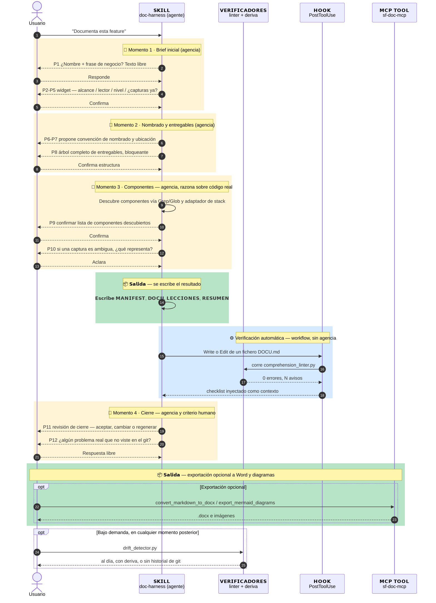

# Fuente temporal — diagrama storytelling del desarrollo (sequenceDiagram)

```mermaid
sequenceDiagram
    autonumber
    actor Usuario
    participant Skill as 𝗦𝗞𝗜𝗟𝗟<br/>doc-harness (agente)
    participant Verif as 𝗩𝗘𝗥𝗜𝗙𝗜𝗖𝗔𝗗𝗢𝗥𝗘𝗦<br/>linter + deriva
    participant Hook as 𝗛𝗢𝗢𝗞<br/>PostToolUse
    participant MCP as 𝗠𝗖𝗣 𝗧𝗢𝗢𝗟<br/>sf-doc-mcp

    Usuario->>Skill: "Documenta esta feature"

    rect rgb(255, 244, 214)
    Note over Skill: 🧠 Momento 1 · Brief inicial (agencia)
    Skill-->>Usuario: P1 ¿Nombre + frase de negocio? Texto libre
    Usuario-->>Skill: Responde
    Skill-->>Usuario: P2-P5 widget — alcance / lector / nivel / ¿capturas ya?
    Usuario-->>Skill: Confirma
    end

    rect rgb(255, 244, 214)
    Note over Skill: 🧠 Momento 2 · Nombrado y entregables (agencia)
    Skill-->>Usuario: P6-P7 propone convención de nombrado y ubicación
    Skill-->>Usuario: P8 árbol completo de entregables, bloqueante
    Usuario-->>Skill: Confirma estructura
    end

    rect rgb(255, 244, 214)
    Note over Skill: 🧠 Momento 3 · Componentes — agencia, razona sobre código real
    Skill->>Skill: Descubre componentes vía Grep/Glob y adaptador de stack
    Skill-->>Usuario: P9 confirmar lista de componentes descubiertos
    Usuario-->>Skill: Confirma
    Skill-->>Usuario: P10 si una captura es ambigua, ¿qué representa?
    Usuario-->>Skill: Aclara
    end

    rect rgb(183, 228, 199)
    Note over Skill: 📦 𝗦𝗮𝗹𝗶𝗱𝗮 — se escribe el resultado
    Skill->>Skill: 𝗘𝘀𝗰𝗿𝗶𝗯𝗲 𝗠𝗔𝗡𝗜𝗙𝗘𝗦𝗧, 𝗗𝗢𝗖𝗨, 𝗟𝗘𝗖𝗖𝗜𝗢𝗡𝗘𝗦, 𝗥𝗘𝗦𝗨𝗠𝗘𝗡
    end

    rect rgb(214, 234, 255)
    Note over Hook,Verif: ⚙️ Verificación automática — workflow, sin agencia
    Skill->>Hook: Write o Edit de un fichero DOCU.md
    Hook->>Verif: corre comprehension_linter.py
    Verif-->>Hook: 0 errores, N avisos
    Hook-->>Skill: checklist inyectado como contexto
    end

    rect rgb(255, 244, 214)
    Note over Skill: 🧠 Momento 4 · Cierre — agencia y criterio humano
    Skill-->>Usuario: P11 revisión de cierre — aceptar, cambiar o regenerar
    Skill-->>Usuario: P12 ¿algún problema real que no viste en el git?
    Usuario-->>Skill: Respuesta libre
    end

    rect rgb(183, 228, 199)
    Note over Usuario,MCP: 📦 𝗦𝗮𝗹𝗶𝗱𝗮 — exportación opcional a Word y diagramas
    opt Exportación opcional
    Usuario->>MCP: convert_markdown_to_docx / export_mermaid_diagrams
    MCP-->>Usuario: .docx e imágenes
    end
    end

    opt Bajo demanda, en cualquier momento posterior
    Usuario->>Verif: drift_detector.py
    Verif-->>Usuario: al día, con deriva, o sin historial de git
    end
```
